Repository Summary:
Files analyzed: 37
Directories scanned: 145
Total size: 86.96 KB (89048 bytes)
Estimated tokens: 22262
Processing time: 0.16 seconds


## Table of Contents

- [Project Summary](#project-summary)
- [Directory Structure](#directory-structure)
- [Files Content](#files-content)
  - Files By Category:
    - Configuration (2 files):
      - [.gitignore](#_gitignore) - 394 bytes
      - [pom.xml](#pom_xml) - 1.8 KB
    - Java (28 files):
      - [Administrador.java](#Administrador_java) - 477 bytes
      - [AsignacionBonificacion.java](#AsignacionBonificacion_java) - 1.2 KB
      - [Bonificacion.java](#Bonificacion_java) - 545 bytes
      - [BonificacionAsignadaDTO.java](#BonificacionAsignadaDTO_java) - 438 bytes
      - [CabeceraPropietarioDTO.java](#CabeceraPropietarioDTO_java) - 483 bytes
      - [CasoUsoTableroPropietario.java](#CasoUsoTableroPropietario_java) - 3.2 KB
      - [Categoria.java](#Categoria_java) - 536 bytes
      - [ControladorLogin.java](#ControladorLogin_java) - 2.7 KB
      - [Estado.java](#Estado_java) - 527 bytes
      - [Fachada.java](#Fachada_java) - 2.0 KB
      - [and 18 more Java files...]
    - JavaScript/TypeScript (2 files):
      - [utilesVista.js](#utilesVista_js) - 11.8 KB
      - [vistaWeb.js](#vistaWeb_js) - 5.2 KB
    - Other (2 files):
      - [.gitattributes](#_gitattributes) - 38 bytes
      - [mvnw](#mvnw) - 11.5 KB
    - Web (3 files):
      - [Estilos.css](#Estilos_css) - 2.4 KB
      - [login.html](#login_html) - 1.7 KB
      - [TableroControlPropietario.html](#TableroControlPropietario_html) - 8.9 KB
- [Architecture and Relationships](#architecture-and-relationships)
  - [File Dependencies](#file-dependencies)
  - [Class Relationships](#class-relationships)
  - [Component Interactions](#component-interactions)

## Project Summary <a id="project-summary"></a>

# Project Digest: obligatorio
Generated on: Sun Oct 26 2025 16:21:44 GMT-0300 (Uruguay Standard Time)
Source: c:\Users\alay\OneDrive - The Descartes Systems Group Inc\General\ORT\2025\Segundo semestre\DA\Obligatorio\Obligatorio\obligatorio
Project Directory: c:\Users\alay\OneDrive - The Descartes Systems Group Inc\General\ORT\2025\Segundo semestre\DA\Obligatorio\Obligatorio\obligatorio

# Directory Structure
[DIR] .
  [DIR] .git
  [FILE] .gitattributes
  [FILE] .gitignore
  [DIR] .mvn
    [DIR] wrapper
  [DIR] .vscode
  [DIR] CodeFlattened_Output
  [FILE] HELP.md
  [FILE] mvnw
  [FILE] pom.xml
  [DIR] src
    [DIR] main
      [DIR] java
        [DIR] obligatorio
          [DIR] obligatorio
            [DIR] Controladores
              [FILE] CasoUsoTableroPropietario.java
              [FILE] ControladorLogin.java
              [FILE] Respuesta.java
            [DIR] DTO
              [FILE] BonificacionAsignadaDTO.java
              [FILE] CabeceraPropietarioDTO.java
              [FILE] NotificacionDTO.java
              [FILE] TransitoDTO.java
              [FILE] VehiculoResumenDTO.java
            [FILE] GlobalExceptionHandler.java
            [DIR] Modelo
              [FILE] Administrador.java
              [FILE] AsignacionBonificacion.java
              [FILE] Bonificacion.java
              [FILE] Categoria.java
              [FILE] Estado.java
              [FILE] Fachada.java
              [FILE] Notificacion.java
              [FILE] ObligatorioException.java
              [FILE] PrecargaDatos.java
              [FILE] Propietario.java
              [FILE] Puesto.java
              [FILE] Sesion.java
              [FILE] SistemaAcceso.java
              [FILE] SistemaTablero.java
              [FILE] Tarifa.java
              [FILE] Transito.java
              [FILE] Usuario.java
              [FILE] Vehiculo.java
            [FILE] ObligatorioApplication.java
      [DIR] resources
        [DIR] static
          [FILE] Estilos.css
          [FILE] login.html
          [FILE] TableroControlPropietario.html
          [FILE] utilesVista.js
          [FILE] vistaWeb.js
        [DIR] templates
    [DIR] test
  [DIR] target

# Files Content

## src\main\java\obligatorio\obligatorio\Modelo\Administrador.java <a id="Administrador_java"></a> 🔄 **[RECENTLY MODIFIED]**

### Dependencies

- `java.util.Objects`

package obligatorio.obligatorio.Modelo;

import java.util.Objects;

public final class Administrador extends Usuario {
    public Administrador(String cedula, String password, String nombreCompleto) {
        super(cedula, password, nombreCompleto);
    }

    @Override
    public boolean equals(Object o){ return o instanceof Administrador a && getCedula().equals(a.getCedula()); }
    @Override
    public int hashCode(){ return Objects.hash(getCedula()); }
}

## src\main\java\obligatorio\obligatorio\Controladores\ControladorLogin.java <a id="ControladorLogin_java"></a> 🔄 **[RECENTLY MODIFIED]**

### Dependencies

- `java.util.List`
- `org.springframework.web.bind.annotation.PostMapping`
- `org.springframework.web.bind.annotation.RequestMapping`
- `org.springframework.web.bind.annotation.RequestParam`
- `org.springframework.web.bind.annotation.RestController`
- `jakarta.servlet.http.HttpSession`
- `obligatorio.obligatorio.Modelo.Administrador`
- `obligatorio.obligatorio.Modelo.Fachada`
- `obligatorio.obligatorio.Modelo.ObligatorioException`
- `obligatorio.obligatorio.Modelo.Sesion`

package obligatorio.obligatorio.Controladores;

import java.util.List;

import org.springframework.web.bind.annotation.PostMapping;
import org.springframework.web.bind.annotation.RequestMapping;
import org.springframework.web.bind.annotation.RequestParam;
import org.springframework.web.bind.annotation.RestController;

import jakarta.servlet.http.HttpSession;
import obligatorio.obligatorio.Modelo.Administrador;
import obligatorio.obligatorio.Modelo.Fachada;
import obligatorio.obligatorio.Modelo.ObligatorioException;
import obligatorio.obligatorio.Modelo.Sesion;

@RestController
@RequestMapping("/acceso")
public class ControladorLogin {

@PostMapping("/loginPropietario")
public List<Respuesta> loginPropietario(HttpSession sesionHttp,
                                        @RequestParam String cedula,
                                        @RequestParam String password) throws ObligatorioException {
    Sesion sesion = Fachada.getInstancia().loginPropietario(cedula, password);
    logoutPropietario(sesionHttp);
    sesionHttp.setAttribute("usuarioPropietario", sesion);
    sesionHttp.setAttribute("propietario", sesion.getPropietario());

    return Respuesta.lista(new Respuesta("loginExitoso", "TableroControlPropietario.html"));
}

    @PostMapping("/loginAdministrador")
    public List<Respuesta> loginAdministrador(HttpSession sesionHttp,
                                              @RequestParam String cedula,
                                              @RequestParam String password) throws ObligatorioException {
        Administrador admin = Fachada.getInstancia().loginAdministrador(cedula, password);
        sesionHttp.setAttribute("usuarioAdmin", admin);
        return Respuesta.lista(new Respuesta("loginExitoso", "monitor-actividad.html"));
    }

    @PostMapping("/logoutPropietario")
    public List<Respuesta> logoutPropietario(HttpSession sesionHttp) throws ObligatorioException {
        Object obj = sesionHttp.getAttribute("usuarioPropietario");
        if (obj instanceof Sesion s) {
            Fachada.getInstancia().logout(s);
            sesionHttp.removeAttribute("usuarioPropietario");
        }
        return Respuesta.lista(new Respuesta("paginaLogin", "login.html"));
    }

    @PostMapping("/logoutAdmin")
    public List<Respuesta> logoutAdmin(HttpSession sesionHttp) {
        Object obj = sesionHttp.getAttribute("usuarioAdmin");
        if (obj instanceof Administrador a) {
            obligatorio.obligatorio.Modelo.Fachada.getInstancia().logoutAdministrador(a.getCedula());
            sesionHttp.removeAttribute("usuarioAdmin");
        }
        return Respuesta.lista(new Respuesta("paginaLogin", "login-admin.html"));
    }

}

## src\main\java\obligatorio\obligatorio\Modelo\PrecargaDatos.java <a id="PrecargaDatos_java"></a> 🔄 **[RECENTLY MODIFIED]**

### Dependencies

- `java.math.BigDecimal`
- `java.time.LocalDate`
- `java.time.LocalDateTime`
- `java.util.ArrayList`
- `java.util.List`

package obligatorio.obligatorio.Modelo;

import java.math.BigDecimal;
import java.time.LocalDate;
import java.time.LocalDateTime;
import java.util.ArrayList;
import java.util.List;

public final class PrecargaDatos {
    private final List<Administrador> administradores = new ArrayList<>();
    private final List<Propietario> propietarios = new ArrayList<>();
    private final List<Puesto> puestos = new ArrayList<>();
    private final List<Categoria> categorias = new ArrayList<>();
    private final List<Tarifa> tarifas = new ArrayList<>();
    private final List<Vehiculo> vehiculos = new ArrayList<>();
    private final List<Bonificacion> bonificaciones = new ArrayList<>();
    private final List<Estado> estados = new ArrayList<>();
    private final List<AsignacionBonificacion> asignaciones = new ArrayList<>();

    // Solo para referencia/depuración (la fachada es la fuente de verdad de tránsitos)
    private final List<Notificacion> notificaciones = new ArrayList<>();
    private final List<Transito> transitos = new ArrayList<>();

    public static PrecargaDatos crear() throws ObligatorioException {
        PrecargaDatos d = new PrecargaDatos();
        d.cargar();
        return d;
    }

    public List<Administrador> getAdministradores() { return administradores; }
    public List<Propietario> getPropietarios() { return propietarios; }
    public List<Puesto> getPuestos() { return puestos; }
    public List<Categoria> getCategorias() { return categorias; }
    public List<Tarifa> getTarifas() { return tarifas; }
    public List<Vehiculo> getVehiculos() { return vehiculos; }
    public List<Bonificacion> getBonificaciones() { return bonificaciones; }
    public List<Estado> getEstados() { return estados; }
    public List<AsignacionBonificacion> getAsignaciones() { return asignaciones; }
    public List<Notificacion> getNotificaciones() { return notificaciones; }
    public List<Transito> getTransitos() { return transitos; }

    private void cargar() throws ObligatorioException {
        Fachada f = Fachada.getInstancia();

        // ----- Estados -----
        Estado habilitado   = new Estado("Habilitado");
        Estado deshabilitado= new Estado("Deshabilitado");
        Estado suspendido   = new Estado("Suspendido");
        Estado penalizado   = new Estado("Penalizado");
        estados.add(habilitado);
        estados.add(deshabilitado);
        estados.add(suspendido);
        estados.add(penalizado);

        // ----- Administradores -----
        Administrador admin1 = new Administrador("a", "a", "Usuario Administrador");
        Administrador admin2 = new Administrador("87654321", "root.123", "Admin Secundario");
        administradores.add(admin1);
        administradores.add(admin2);

        // ----- Propietarios (aún sin registrar en SistemaAcceso) -----
        Propietario prop1 = new Propietario("1", "1", "Walter",
                new BigDecimal("2000.00"), new BigDecimal("500.00"), habilitado);
        Propietario prop2 = new Propietario("34567890", "prop.456", "Propietario Dos",
                new BigDecimal("800.00"), new BigDecimal("200.00"), habilitado);

        propietarios.add(prop1);
        propietarios.add(prop2);

        // ----- Categorías -----
        Categoria auto  = new Categoria("Automóvil");
        Categoria camion= new Categoria("Camión");
        Categoria moto  = new Categoria("Moto");
        categorias.add(auto);
        categorias.add(camion);
        categorias.add(moto);

        // ----- Bonificaciones -----
        Bonificacion exonerados  = new Bonificacion("Exonerados");
        Bonificacion frecuentes  = new Bonificacion("Frecuentes");
        Bonificacion trabajadores= new Bonificacion("Trabajadores");
        bonificaciones.add(exonerados);
        bonificaciones.add(frecuentes);
        bonificaciones.add(trabajadores);

        // ----- Puestos -----
        Puesto p1 = new Puesto("Peaje Santa Lucía", "Ruta 5 KM 56");
        Puesto p2 = new Puesto("Peaje Pando", "Ruta Interbalnearia KM 32");
        puestos.add(p1);
        puestos.add(p2);

        // ----- Tarifas -----
        Tarifa t11 = new Tarifa(p1, auto,   new BigDecimal("120.00"));
        Tarifa t12 = new Tarifa(p1, camion, new BigDecimal("300.00"));
        Tarifa t13 = new Tarifa(p1, moto,   new BigDecimal("80.00"));

        Tarifa t21 = new Tarifa(p2, auto,   new BigDecimal("100.00"));
        Tarifa t22 = new Tarifa(p2, camion, new BigDecimal("270.00"));
        Tarifa t23 = new Tarifa(p2, moto,   new BigDecimal("70.00"));

        p1.agregarTarifa(t11); p1.agregarTarifa(t12); p1.agregarTarifa(t13);
        p2.agregarTarifa(t21); p2.agregarTarifa(t22); p2.agregarTarifa(t23);

        tarifas.add(t11); tarifas.add(t12); tarifas.add(t13);
        tarifas.add(t21); tarifas.add(t22); tarifas.add(t23);

        // ----- Vehículos (asociados a propietarios) -----
        Vehiculo v1 = new Vehiculo("SBA1234", "Sedan",      "Rojo",  auto,   prop1);
        Vehiculo v2 = new Vehiculo("SBC5678", "Camión 3/4", "Azul",  camion, prop1);
        Vehiculo v3 = new Vehiculo("SBD9012", "Street",     "Negro", moto,   prop2);

        prop1.agregarVehiculo(v1);
        prop1.agregarVehiculo(v2);
        prop2.agregarVehiculo(v3);

        vehiculos.add(v1); vehiculos.add(v2); vehiculos.add(v3);

        // ----- Asignaciones de bonificación -----
        AsignacionBonificacion a1 = new AsignacionBonificacion(prop1, p1, frecuentes,  LocalDate.now().minusDays(5));
        AsignacionBonificacion a2 = new AsignacionBonificacion(prop1, p2, exonerados,  LocalDate.now().minusDays(2));
        AsignacionBonificacion a3 = new AsignacionBonificacion(prop2, p1, trabajadores,LocalDate.now().minusDays(1));

        prop1.agregarAsignacion(a1);
        prop1.agregarAsignacion(a2);
        prop2.agregarAsignacion(a3);

        asignaciones.add(a1); asignaciones.add(a2); asignaciones.add(a3);

        // ----- Notificaciones -----
        Notificacion n11 = new Notificacion("Recarga acreditada: $500",
                LocalDateTime.now().minusHours(2));
        Notificacion n12 = new Notificacion("Saldo bajo: recuerde recargar",
                LocalDateTime.now().minusDays(1).withHour(9).withMinute(30));
        prop1.agregarNotificacion(n11);
        prop1.agregarNotificacion(n12);
        notificaciones.add(n11); notificaciones.add(n12);

        Notificacion n21 = new Notificacion("Bonificación 'Trabajadores' aplicada en Peaje Santa Lucía",
                LocalDateTime.now().minusHours(5));
        prop2.agregarNotificacion(n21);
        notificaciones.add(n21);

        // ===== AHORA SÍ: registrar propietarios ya poblados en SistemaAcceso =====
        f.registrarPropietario(prop1);
        f.registrarPropietario(prop2);

        // ----- Tránsitos (coherentes con tarifas/bonificaciones) -----
        // v1 (auto) por p1 (tarifa 120) con FRECUENTES => cobra 100
        BigDecimal base_v1_p1   = t11.getMonto();             // 120.00
        BigDecimal bonif_v1_p1  = new BigDecimal("20.00");    // ejemplo
        BigDecimal cobrado_v1_p1= base_v1_p1.subtract(bonif_v1_p1); // 100.00
        Transito tr1 = new Transito(
                v1, p1, t11,
                LocalDateTime.now().minusHours(3),
                base_v1_p1,
                cobrado_v1_p1,
                frecuentes,
                true);

        // v2 (camión) por p2 (tarifa 270) con EXONERADOS => cobra 0
        BigDecimal base_v2_p2   = t22.getMonto();             // 270.00
        Transito tr2 = new Transito(
                v2, p2, t22,
                LocalDateTime.now().minusDays(1).withHour(18).withMinute(15),
                base_v2_p2,
                BigDecimal.ZERO,
                exonerados,
                true);

        // v3 (moto) por p1 (tarifa 80) sin bonificación => cobra 80
        BigDecimal base_v3_p1   = t13.getMonto();             // 80.00
        Transito tr3 = new Transito(
                v3, p1, t13,
                LocalDateTime.now().minusDays(2).withHour(8).withMinute(5),
                base_v3_p1,
                base_v3_p1,
                null,
                true);

        // Registrar en fachada (fuente de verdad de tránsitos)
        f.registrarTransito(tr1);
        f.registrarTransito(tr2);
        f.registrarTransito(tr3);

        // Mantener en la lista local (solo referencia/depuración)
        transitos.add(tr1);
        transitos.add(tr2);
        transitos.add(tr3);
    }
}

## src\main\java\obligatorio\obligatorio\Controladores\CasoUsoTableroPropietario.java <a id="CasoUsoTableroPropietario_java"></a> 🔄 **[RECENTLY MODIFIED]**

### Dependencies

- `java.math.BigDecimal`
- `java.util.List`
- `org.springframework.http.HttpHeaders`
- `org.springframework.http.HttpStatusCode`
- `org.springframework.http.ResponseEntity`
- `org.springframework.web.bind.annotation.PostMapping`
- `org.springframework.web.bind.annotation.RequestMapping`
- `org.springframework.web.bind.annotation.RequestParam`
- `org.springframework.web.bind.annotation.RestController`
- `jakarta.servlet.http.HttpSession`
- `obligatorio.obligatorio.Modelo.Fachada`
- `obligatorio.obligatorio.Modelo.ObligatorioException`
- `obligatorio.obligatorio.Modelo.Propietario`
- `obligatorio.obligatorio.Modelo.Sesion`

package obligatorio.obligatorio.Controladores;

import java.math.BigDecimal;
import java.util.List;

import org.springframework.http.HttpHeaders;
import org.springframework.http.HttpStatusCode;
import org.springframework.http.ResponseEntity;
import org.springframework.web.bind.annotation.PostMapping;
import org.springframework.web.bind.annotation.RequestMapping;
import org.springframework.web.bind.annotation.RequestParam;
import org.springframework.web.bind.annotation.RestController;

import jakarta.servlet.http.HttpSession;
import obligatorio.obligatorio.Modelo.Fachada;
import obligatorio.obligatorio.Modelo.ObligatorioException;
import obligatorio.obligatorio.Modelo.Propietario;
import obligatorio.obligatorio.Modelo.Sesion;

@RestController
@RequestMapping("/propietario")
public class CasoUsoTableroPropietario {

    private Propietario propietarioEnSesion(HttpSession sesionHttp) throws ObligatorioException {
        Object obj = sesionHttp.getAttribute("usuarioPropietario");
        if (obj instanceof Sesion s && s.getPropietario() != null) {
            return s.getPropietario();
        }
        throw new ObligatorioException("Sesión expirada o no iniciada");
    }

@PostMapping("/tablero")
public Object cargarTablero(HttpSession sesionHttp) {
    Object obj = sesionHttp.getAttribute("usuarioPropietario");
    if (obj instanceof Sesion s && s.getPropietario() != null) {
        Propietario p = s.getPropietario();
        System.out.printf(
            "DEBUG tablero: cedula=%s | vehiculos=%d | asignaciones=%d | notificaciones=%d | transitos=%d%n",
            p.getCedula(),
            p.getVehiculos().size(),
            p.getAsignaciones().size(),
            p.getNotificaciones().size(),
            Fachada.getInstancia().getTransitos().size()
        );
        return Fachada.getInstancia().armarRespuestasTablero(p);
    }
    return ResponseEntity.badRequest().body("Sesión expirada o no iniciada");
}

    @PostMapping("/notificaciones/borrar")
    public Object borrarNotificaciones(HttpSession sesionHttp) {
        try {
            Propietario p = propietarioEnSesion(sesionHttp);
            int cant = Fachada.getInstancia().borrarNotificaciones(p);
            if (cant == 0) {
                HttpHeaders h = new HttpHeaders();
                h.add(HttpHeaders.CONTENT_TYPE, "text/plain; charset=UTF-8");
                return new ResponseEntity<>("No hay notificaciones para borrar", h, HttpStatusCode.valueOf(299));
            }
            return Respuesta.lista(
                new Respuesta("notificacionesBorradas", cant),
                new Respuesta("notificaciones", List.of())
            );
        } catch (ObligatorioException e) {
            return ResponseEntity.badRequest().body(e.getMessage());
        }
    }

    @PostMapping("/recargarSaldo")
    public Object recargarSaldo(HttpSession sesionHttp, @RequestParam BigDecimal monto) {
        try {
            Propietario p = propietarioEnSesion(sesionHttp);
            Fachada.getInstancia().recargarSaldo(p, monto);
            return Fachada.getInstancia().armarRespuestasTablero(p);
        } catch (ObligatorioException e) {
            return ResponseEntity.badRequest().body(e.getMessage());
        }
    }
}

## src\main\java\obligatorio\obligatorio\Modelo\SistemaAcceso.java <a id="SistemaAcceso_java"></a> 🔄 **[RECENTLY MODIFIED]**

### Dependencies

- `java.math.BigDecimal`
- `java.time.LocalDateTime`
- `java.util.ArrayList`
- `java.util.HashSet`
- `java.util.List`
- `java.util.Set`

package obligatorio.obligatorio.Modelo;

import java.math.BigDecimal;
import java.time.LocalDateTime;
import java.util.ArrayList;
import java.util.HashSet;
import java.util.List;
import java.util.Set;

public class SistemaAcceso {
    private final List<Propietario> propietarios = new ArrayList<>();
    private final List<Administrador> administradores = new ArrayList<>();
    private final List<Sesion> sesiones = new ArrayList<>();
    private final Set<String> administradoresLogueados = new HashSet<>();
    private final List<Transito> transitos = new ArrayList<>();

    public void agregarPropietario(Propietario p) throws ObligatorioException {
        if (p == null) throw new ObligatorioException("Propietario nulo");
        if (p.getCedula() == null || p.getCedula().isBlank()) throw new ObligatorioException("Cédula requerida");
        boolean existe = propietarios.stream().anyMatch(x -> x.getCedula().equals(x.getCedula()));
        if (existe) throw new ObligatorioException("Ya existe un propietario con esa cédula");
        propietarios.add(p);
    }

    public void agregarPropietario(String cedula, String pwd, String nombreCompleto,
                                   BigDecimal saldo, BigDecimal saldoMin, Estado estado) throws ObligatorioException {
        if (estado == null) estado = new Estado("Habilitado");
        agregarPropietario(new Propietario(cedula, pwd, nombreCompleto, saldo, saldoMin, estado));
    }

    public void agregarAdministrador(Administrador a) throws ObligatorioException {
        if (a == null) throw new ObligatorioException("Administrador nulo");
        if (a.getCedula() == null || a.getCedula().isBlank()) throw new ObligatorioException("Cédula requerida");
        boolean existe = administradores.stream().anyMatch(x -> x.getCedula().equals(a.getCedula()));
        if (existe) throw new ObligatorioException("Ya existe un administrador con esa cédula");
        administradores.add(a);
    }

    public void agregarAdministrador(String cedula, String pwd, String nombreCompleto) throws ObligatorioException {
        agregarAdministrador(new Administrador(cedula, pwd, nombreCompleto));
    }

    public Sesion loginPropietario(String cedula, String pwd) throws ObligatorioException {
        for (Propietario p : propietarios) {
            if (p.getCedula().equals(cedula) && p.getPassword().equals(pwd)) {
                String nombreEstado = p.getEstadoActual() != null ? p.getEstadoActual().getNombre() : null;
                if (nombreEstado == null || !nombreEstado.equalsIgnoreCase("Habilitado"))
                    throw new ObligatorioException("Usuario deshabilitado, no puede ingresar al sistema");
                Sesion s = new Sesion(p);
                sesiones.add(s);
                return s;
            }
        }
        throw new ObligatorioException("Login incorrecto");
    }

    public Administrador loginAdministrador(String cedula, String pwd) throws ObligatorioException {
        for (Administrador a : administradores) {
            if (a.getCedula().equals(cedula) && a.getPassword().equals(pwd)) {
                if (administradoresLogueados.contains(cedula))
                    throw new ObligatorioException("Ud. ya está logueado");
                administradoresLogueados.add(cedula);
                return a;
            }
        }
        throw new ObligatorioException("Login incorrecto");
    }

    public List<Sesion> getSesiones() { return sesiones; }
    public void logout(Sesion s) { sesiones.remove(s); }
    public void logoutAdministrador(String cedula) { if (cedula != null) administradoresLogueados.remove(cedula); }

    public void recargarSaldo(Propietario p, BigDecimal monto) throws ObligatorioException {
        if (p == null) throw new ObligatorioException("Sesión expirada");
        if (monto == null || monto.compareTo(BigDecimal.ZERO) <= 0)
            throw new ObligatorioException("El monto debe ser mayor que cero");
        p.setSaldoActual(p.getSaldoActual().add(monto));
        p.agregarNotificacion(new Notificacion("Recarga acreditada: $" + monto, LocalDateTime.now()));
    }

    public void registrarTransito(Transito t) { if (t != null) transitos.add(t); }
    public List<Transito> getTransitos() { return transitos; }
}

## src\main\java\obligatorio\obligatorio\Modelo\Propietario.java <a id="Propietario_java"></a> 🔄 **[RECENTLY MODIFIED]**

### Dependencies

- `java.math.BigDecimal`
- `java.util.ArrayList`
- `java.util.Collections`
- `java.util.HashSet`
- `java.util.List`
- `java.util.Objects`
- `java.util.Set`

package obligatorio.obligatorio.Modelo;

import java.math.BigDecimal;
import java.util.ArrayList;
import java.util.Collections;
import java.util.HashSet;
import java.util.List;
import java.util.Objects;
import java.util.Set;

public final class Propietario extends Usuario {
    private BigDecimal saldoActual;
    private BigDecimal saldoMinimoAlerta;
    private Estado estadoActual;
    private final Set<Vehiculo> vehiculos = new HashSet<>();
    private final List<Notificacion> notificaciones = new ArrayList<>();
    private final Set<AsignacionBonificacion> asignaciones = new HashSet<>();

    public Propietario(String cedula, String password, String nombreCompleto,
                       BigDecimal saldoActual, BigDecimal saldoMinimoAlerta, Estado estadoActual) {
        super(cedula, password, nombreCompleto);
        this.saldoActual = Objects.requireNonNull(saldoActual);
        this.saldoMinimoAlerta = Objects.requireNonNull(saldoMinimoAlerta);
        this.estadoActual = Objects.requireNonNull(estadoActual);
    }

    public BigDecimal getSaldoActual() { return saldoActual; }
    public void setSaldoActual(BigDecimal saldoActual) { this.saldoActual = saldoActual; }
    public BigDecimal getSaldoMinimoAlerta() { return saldoMinimoAlerta; }
    public void setSaldoMinimoAlerta(BigDecimal saldoMinimoAlerta) { this.saldoMinimoAlerta = saldoMinimoAlerta; }
    public Estado getEstadoActual() { return estadoActual; }
    public void setEstadoActual(Estado estadoActual) { this.estadoActual = estadoActual; }
    public Set<Vehiculo> getVehiculos() { return Collections.unmodifiableSet(vehiculos); }
    public List<Notificacion> getNotificaciones() { return Collections.unmodifiableList(notificaciones); }
    public Set<AsignacionBonificacion> getAsignaciones() { return Collections.unmodifiableSet(asignaciones); }
    public boolean agregarVehiculo(Vehiculo v){ return vehiculos.add(v); }
    public void agregarNotificacion(Notificacion n){ notificaciones.add(n); }
    public boolean agregarAsignacion(AsignacionBonificacion a){ return asignaciones.add(a); }
    public int cantidadNotificaciones() { return notificaciones.size(); }
    public void limpiarNotificaciones() { notificaciones.clear(); }

    @Override
    public boolean equals(Object o){ return o instanceof Propietario p && getCedula().equals(p.getCedula()); }
    @Override
    public int hashCode(){ return Objects.hash(getCedula()); }
}

## src\main\java\obligatorio\obligatorio\Modelo\Fachada.java <a id="Fachada_java"></a> 🔄 **[RECENTLY MODIFIED]**

### Dependencies

- `java.math.BigDecimal`
- `java.util.List`
- `obligatorio.obligatorio.Controladores.Respuesta`

package obligatorio.obligatorio.Modelo;

import java.math.BigDecimal;
import java.util.List;

import obligatorio.obligatorio.Controladores.Respuesta;

public class Fachada {
    private static final Fachada INST = new Fachada();
    public static Fachada getInstancia() { return INST; }
    private Fachada() {}

    private final SistemaAcceso sAcceso = new SistemaAcceso();
    private final SistemaTablero sTablero = new SistemaTablero();

    public void registrarTransito(Transito t) { sAcceso.registrarTransito(t); }
    public List<Transito> getTransitos() { return sAcceso.getTransitos(); }

    public void agregarPropietario(String cedula, String pwd, String nombreCompleto,
                                   BigDecimal saldo, BigDecimal saldoMin, Estado estado)
            throws ObligatorioException { sAcceso.agregarPropietario(cedula, pwd, nombreCompleto, saldo, saldoMin, estado); }

    public void registrarPropietario(Propietario p) throws ObligatorioException { sAcceso.agregarPropietario(p); }

    public void agregarAdministrador(String cedula, String pwd, String nombreCompleto)
            throws ObligatorioException { sAcceso.agregarAdministrador(cedula, pwd, nombreCompleto); }

    public Sesion loginPropietario(String cedula, String pwd) throws ObligatorioException { return sAcceso.loginPropietario(cedula, pwd); }

    public Administrador loginAdministrador(String cedula, String pwd) throws ObligatorioException { return sAcceso.loginAdministrador(cedula, pwd); }

    public List<Sesion> getSesiones() { return sAcceso.getSesiones(); }
    public void logout(Sesion s) { sAcceso.logout(s); }
    public void logoutAdministrador(String cedula) { sAcceso.logoutAdministrador(cedula); }
    public void recargarSaldo(Propietario p, BigDecimal monto) throws ObligatorioException { sAcceso.recargarSaldo(p, monto); }

    public List<Respuesta> armarRespuestasTablero(Propietario p) { return sTablero.armarRespuestasTablero(p); }
    public int borrarNotificaciones(Propietario p) { return sTablero.borrarNotificaciones(p); }
}

## src\main\resources\static\login.html <a id="login_html"></a> 🔄 **[RECENTLY MODIFIED]**

### Dependencies

- `utilesVista.js`
- `vistaWeb.js`
- `Estilos.css`

<!DOCTYPE html>
<html lang="es">
<head>
  <meta charset="UTF-8" />
  <meta name="viewport" content="width=device-width, initial-scale=1.0" />
  <title>Login</title>
  <link rel="stylesheet" href="Estilos.css" />
</head>
<body>
  <div class="login-container">
    <h2>Iniciar Sesión</h2>

    <form id="formLogin" method="post" onsubmit="handleLogin(event)">
      <div class="input-group">
        <label for="cedula">Cédula</label>
        <input type="text" id="cedula" name="cedula" required />
      </div>

      <div class="input-group">
        <label for="password">Contraseña</label>
        <input type="password" id="password" name="password" required />
      </div>

      <button type="submit">Entrar</button>
    </form>
  </div>

  <!-- Utilidades (serializarFormulario, diálogos, etc.) -->
  <script src="utilesVista.js"></script>
  <!-- Infra de submit/procesamiento de respuestas -->
  <script src="vistaWeb.js"></script>

  <script>
    function handleLogin(event) {
      event.preventDefault();
      // Envía cedula/password como x-www-form-urlencoded
      submit("acceso/loginPropietario", serializarFormulario("formLogin"));
    }

    // Redirección post-login: acepta "tablero.html" o "/tablero.html" y fuerza ruta absoluta
    function mostrar_loginExitoso(urlDestino) {
      const url = urlDestino && urlDestino.startsWith('/') ? urlDestino : `/${urlDestino || ''}`;
      window.location.href = url;
    }

    // Mensajes de negocio desde el backend (status 299 en tu infra)
    async function excepcionDeAplicacion(text) {
      try {
        await mostrarMensaje(text);
      } catch (_) {
        alert(text);
      }
    }
  </script>
</body>
</html>

## src\main\java\obligatorio\obligatorio\Modelo\Sesion.java <a id="Sesion_java"></a> 🔄 **[RECENTLY MODIFIED]**

### Dependencies

- `java.util.Date`

package obligatorio.obligatorio.Modelo;

import java.util.Date;

public class Sesion {
    private final Date fechaIngreso = new Date();
    private final Propietario propietario;

    public Sesion(Propietario propietario) {
        this.propietario = propietario;
    }

    public Date getFechaIngreso() { return fechaIngreso; }
    public Propietario getPropietario() { return propietario; }
}

## src\main\java\obligatorio\obligatorio\Modelo\Usuario.java <a id="Usuario_java"></a> 🔄 **[RECENTLY MODIFIED]**

### Dependencies

- `java.util.Objects`

package obligatorio.obligatorio.Modelo;

import java.util.Objects;

public abstract class Usuario {
    private final String cedula;
    private String password;
    private String nombreCompleto;

    public Usuario(String cedula, String password, String nombreCompleto) {
        this.cedula = Objects.requireNonNull(cedula);
        this.password = Objects.requireNonNull(password);
        this.nombreCompleto = Objects.requireNonNull(nombreCompleto);
    }

    public String getCedula() { return cedula; }
    public String getPassword() { return password; }
    public void setPassword(String password) { this.password = password; }
    public String getNombreCompleto() { return nombreCompleto; }
    public void setNombreCompleto(String nombreCompleto) { this.nombreCompleto = nombreCompleto; }

    @Override
    public String toString() { return nombreCompleto; }
}

## src\main\java\obligatorio\obligatorio\Modelo\Bonificacion.java <a id="Bonificacion_java"></a>

### Dependencies

- `java.util.Objects`

package obligatorio.obligatorio.Modelo;

import java.util.Objects;

public final class Bonificacion {
    private final String nombre;

    public Bonificacion(String nombre) { this.nombre = Objects.requireNonNull(nombre); }

    public String getNombre() { return nombre; }

    @Override public boolean equals(Object o){return o instanceof Bonificacion b && nombre.equalsIgnoreCase(b.nombre);}
    @Override public int hashCode(){return nombre.toLowerCase().hashCode();}
    @Override public String toString(){return nombre;}
}

## src\main\resources\static\TableroControlPropietario.html <a id="TableroControlPropietario_html"></a> 🔄 **[RECENTLY MODIFIED]**

### Dependencies

- `vistaWeb.js`
- `utilesVista.js`
- `Estilos.css`

<!DOCTYPE html>
<html lang="es">
<head>
  <meta charset="UTF-8" />
  <meta name="viewport" content="width=device-width, initial-scale=1.0" />
  <title>Tablero de control del propietario</title>

  <link rel="stylesheet" href="Estilos.css">

  <!-- 1) vistaWeb primero (define submit(), etc.) -->
  <script src="vistaWeb.js"></script>

  <!-- 2) Config para iniciar la vista llamando al backend -->
  <script>
    window.urlIniciarVista = "/propietario/tablero";
    window.parametrosInicioVista = "";
    window.urlCierreVista = null;
    window.parametrosCierreVista = "";

    // si no hay sesión, redirige a login
    window.procesarErrorSubmit = function (status, text) {
      if (status === 400) {
        window.location.href = "login.html";
        return;
      }
      console.error("Error en submit:", status, text);
      alert("Se produjo un error");
    };
  </script>

  <!-- 3) utilidades. Dejalo después para asegurar la versión correcta de serializarFormulario -->
  <script defer src="utilesVista.js"></script>

  <style>
    .wrap { max-width: 1100px; margin: 16px auto; }
    .row { display: grid; grid-template-columns: 1fr 1fr; gap: 12px; }
    .card { background: #fff; border-radius: 10px; box-shadow: 0 1px 4px rgba(0,0,0,.08); padding: 14px; }
    .card h3 { margin: 0 0 8px 0; font-size: 1rem; }
    .grid-3 { display: grid; grid-template-columns: repeat(3, 1fr); gap: 10px; }
    .pill { background: #f6f7fb; border: 1px solid #e5e7f0; border-radius: 10px; padding: 10px; }
    .k { font-size: .78rem; color: #666; display: block; }
    .v { font-weight: 600; }
    table { width: 100%; border-collapse: collapse; }
    thead th { text-align: left; background: #f6f7fb; font-weight: 600; border-bottom: 1px solid #e5e7f0; padding: 8px; }
    tbody td { border-bottom: 1px solid #f0f1f6; padding: 8px; }
    .toolbar { display: flex; justify-content: flex-end; margin-top: 8px; }
    .btn { background: #e83e8c; color: #fff; border: 0; border-radius: 8px; padding: 8px 12px; cursor: pointer; }
    .btn:disabled { opacity: .5; cursor: default; }
    .topbar { display: flex; align-items: center; justify-content: space-between; margin-bottom: 10px; }
    .topbar a { color: #888; text-decoration: none; }
    @media (max-width: 900px) {
      .row { grid-template-columns: 1fr; }
      .grid-3 { grid-template-columns: 1fr; }
    }
  </style>
</head>

<body>
  <div class="wrap">
    <div class="topbar">
      <h2>Tablero de control del propietario</h2>
      <a href="#" onclick="logout()">Salir</a>
    </div>

    <!-- Resumen -->
    <div class="card">
      <h3>Resumen del propietario</h3>
      <div class="grid-3">
        <div class="pill"><span class="k">NOMBRE COMPLETO</span><span id="cabeceraNombre" class="v">—</span></div>
        <div class="pill"><span class="k">ESTADO</span><span id="cabeceraEstado" class="v">—</span></div>
        <div class="pill"><span class="k">SALDO ACTUAL</span><span id="cabeceraSaldo" class="v">—</span></div>
      </div>
    </div>

    <div class="row">
      <!-- Bonificaciones -->
      <div class="card">
        <h3>Bonificaciones asignadas</h3>
        <table>
          <thead>
            <tr><th>Bonificación</th><th>Puesto</th><th>Fecha asignada</th></tr>
          </thead>
          <tbody id="tbodyBonificaciones">
            <tr><td colspan="3">Sin bonificaciones</td></tr>
          </tbody>
        </table>
      </div>

      <!-- Vehículos -->
      <div class="card">
        <h3>Vehículos registrados</h3>
        <table>
          <thead>
            <tr><th>Matrícula</th><th>Modelo</th><th>Color</th><th>Tránsitos</th><th>Monto total</th></tr>
          </thead>
          <tbody id="tbodyVehiculos">
            <tr><td colspan="5">Sin vehículos</td></tr>
          </tbody>
        </table>
      </div>
    </div>

    <!-- Tránsitos -->
    <div class="card">
      <h3>Tránsitos realizados</h3>
      <table>
        <thead>
          <tr>
            <th>Puesto</th><th>Matrícula</th><th>Tarifa</th><th>Monto tarifa</th>
            <th>Bonificación</th><th>Monto bonificación</th><th>Monto pagado</th><th>Fecha</th><th>Hora</th>
          </tr>
        </thead>
        <tbody id="tbodyTransitos">
          <tr><td colspan="9">Sin tránsitos</td></tr>
        </tbody>
      </table>
    </div>

    <!-- Notificaciones -->
    <div class="card">
      <div class="topbar" style="margin-bottom:0">
        <h3>Notificaciones del sistema</h3>
        <div class="toolbar">
          <button id="btnBorrarNotifs" class="btn" onclick="borrarNotificaciones()">Borrar notificaciones</button>
        </div>
      </div>
      <table>
        <thead>
          <tr><th>Fecha y hora</th><th>Mensaje</th></tr>
        </thead>
        <tbody id="tbodyNotificaciones">
          <tr><td colspan="2">Sin notificaciones</td></tr>
        </tbody>
      </table>
    </div>

    <!-- ÚNICO bloque de recarga -->
    <div class="card" style="margin-top:16px">
      <h3>Recargar saldo</h3>
      <form id="formRecarga" onsubmit="handleRecarga(event)">
        <label for="monto">Monto</label>
        <input id="monto" name="monto" type="number" min="1" step="1" required />
        <button type="submit">Recargar</button>
      </form>
    </div>
  </div>

  <script>
    // ===== Helpers para mostrar datos devueltos por el backend =====
    function fmtMoneda(v) { try { return new Intl.NumberFormat('es-UY', { style: 'currency', currency: 'UYU' }).format(v); } catch (_) { return "$ " + v; } }
    const setText = (id, val) => document.getElementById(id).textContent = val ?? "—";

    function mostrar_cabecera(dto) {
      setText('cabeceraNombre', dto.propietarioNombreCompleto);
      setText('cabeceraEstado', dto.estado);
      setText('cabeceraSaldo', fmtMoneda(dto.saldoActual));
    }

    function mostrar_bonificaciones(lista) {
      const tbody = document.getElementById('tbodyBonificaciones'); tbody.innerHTML = "";
      if (!lista || !lista.length) { tbody.innerHTML = `<tr><td colspan="3">Sin bonificaciones</td></tr>`; return; }
      for (const b of lista) {
        const tr = document.createElement('tr');
        tr.innerHTML = `<td>${b.bonificacion}</td><td>${b.puesto}</td><td>${b.fechaAsignada ?? "—"}</td>`;
        tbody.appendChild(tr);
      }
    }

    function mostrar_vehiculos(lista) {
      const tbody = document.getElementById('tbodyVehiculos'); tbody.innerHTML = "";
      if (!lista || !lista.length) { tbody.innerHTML = `<tr><td colspan="5">Sin vehículos</td></tr>`; return; }
      for (const v of lista) {
        const tr = document.createElement('tr');
        tr.innerHTML = `<td>${v.matricula}</td><td>${v.modelo}</td><td>${v.color}</td><td>${v.cantidadTransitos ?? 0}</td><td>${fmtMoneda(v.montoTotalGastado ?? 0)}</td>`;
        tbody.appendChild(tr);
      }
    }

    function mostrar_transitos(lista) {
      const tbody = document.getElementById('tbodyTransitos'); tbody.innerHTML = "";
      if (!lista || !lista.length) { tbody.innerHTML = `<tr><td colspan="9">Sin tránsitos</td></tr>`; return; }
      for (const t of lista) {
        const tr = document.createElement('tr');
        tr.innerHTML = `
          <td>${t.puesto}</td><td>${t.matricula}</td><td>${t.nombreTarifa}</td>
          <td>${fmtMoneda(t.montoTarifa)}</td><td>${t.bonificacion ?? "—"}</td>
          <td>${fmtMoneda(t.montoBonificacion ?? 0)}</td><td>${fmtMoneda(t.montoPagado)}</td>
          <td>${t.fecha ?? "—"}</td><td>${t.hora ?? "—"}</td>`;
        tbody.appendChild(tr);
      }
    }

    function mostrar_notificaciones(lista) {
      const tbody = document.getElementById('tbodyNotificaciones'); tbody.innerHTML = "";
      if (!lista || !lista.length) { tbody.innerHTML = `<tr><td colspan="2">Sin notificaciones</td></tr>`; return; }
      for (const n of lista) {
        const tr = document.createElement('tr');
        tr.innerHTML = `<td>${n.fechaHora ?? "—"}</td><td>${n.mensaje}</td>`;
        tbody.appendChild(tr);
      }
    }

    // feedback de borrado
    function mostrar_notificacionesBorradas(cantidad) {
      document.getElementById('tbodyNotificaciones').innerHTML = `<tr><td colspan="2">Sin notificaciones</td></tr>`;
      alert(`Se borraron ${cantidad} notificación(es).`);
    }

    // acciones
    function borrarNotificaciones() { submit("/propietario/notificaciones/borrar", ""); }

    // logout real (endpoint correcto)
    function logout() {
      submit("/acceso/logoutPropietario", "");
      window.location.href = "login.html";
    }

    // errores de negocio
    async function excepcionDeAplicacion(text) { alert(text); }

    // handler de recarga
    function handleRecarga(e) {
      e.preventDefault();
      submit("/propietario/recargarSaldo",
        new URLSearchParams(new FormData(document.getElementById("formRecarga"))).toString());
    }
  </script>
</body>
</html>

## pom.xml <a id="pom_xml"></a>

<?xml version="1.0" encoding="UTF-8"?>
<project xmlns="http://maven.apache.org/POM/4.0.0" xmlns:xsi="http://www.w3.org/2001/XMLSchema-instance"
	xsi:schemaLocation="http://maven.apache.org/POM/4.0.0 https://maven.apache.org/xsd/maven-4.0.0.xsd">
	<modelVersion>4.0.0</modelVersion>
	<parent>
		<groupId>org.springframework.boot</groupId>
		<artifactId>spring-boot-starter-parent</artifactId>
		<version>3.5.6</version>
		<relativePath/> <!-- lookup parent from repository -->
	</parent>
	<groupId>obligatorio</groupId>
	<artifactId>obligatorio</artifactId>
	<version>0.0.1-SNAPSHOT</version>
	<name>obligatorio</name>
	<description>Demo project for Spring Boot</description>
	<url/>
	<licenses>
		<license/>
	</licenses>
	<developers>
		<developer/>
	</developers>
	<scm>
		<connection/>
		<developerConnection/>
		<tag/>
		<url/>
	</scm>
<properties>
    <java.version>24</java.version>
</properties>
	<dependencies>

		<dependency>
			<groupId>org.springframework.boot</groupId>
			<artifactId>spring-boot-starter-actuator</artifactId>
		</dependency>

		<dependency>
			<groupId>org.springframework.boot</groupId>
			<artifactId>spring-boot-starter-web</artifactId>
		</dependency>

		<dependency>
			<groupId>org.springframework.boot</groupId>
			<artifactId>spring-boot-starter-test</artifactId>
			<scope>test</scope>
		</dependency>
	</dependencies>

<build>
  <plugins>
    <plugin>
      <groupId>org.apache.maven.plugins</groupId>
      <artifactId>maven-compiler-plugin</artifactId>
      <version>3.11.0</version>
      <configuration>
        <release>${java.version}</release>
      </configuration>
    </plugin>
    <plugin>
      <groupId>org.springframework.boot</groupId>
      <artifactId>spring-boot-maven-plugin</artifactId>
    </plugin>
  </plugins>
</build>

</project>

## src\main\java\obligatorio\obligatorio\Modelo\AsignacionBonificacion.java <a id="AsignacionBonificacion_java"></a>

### Dependencies

- `java.time.LocalDate`
- `java.util.Objects`

package obligatorio.obligatorio.Modelo;

import java.time.LocalDate;
import java.util.Objects;

public final class AsignacionBonificacion {
    private final Propietario propietario;
    private final Puesto puesto;
    private final Bonificacion bonificacion;
    private final LocalDate fechaAsignacion;

    public AsignacionBonificacion(Propietario propietario, Puesto puesto, Bonificacion bonificacion, LocalDate fechaAsignacion) {
        this.propietario = Objects.requireNonNull(propietario);
        this.puesto = Objects.requireNonNull(puesto);
        this.bonificacion = Objects.requireNonNull(bonificacion);
        this.fechaAsignacion = Objects.requireNonNull(fechaAsignacion);
    }

    public Propietario getPropietario() { return propietario; }
    public Puesto getPuesto() { return puesto; }
    public Bonificacion getBonificacion() { return bonificacion; }
    public LocalDate getFechaAsignacion() { return fechaAsignacion; }

    @Override public boolean equals(Object o){
        if(!(o instanceof AsignacionBonificacion a)) return false;
        return propietario.equals(a.propietario) && puesto.equals(a.puesto);
    }
    @Override public int hashCode(){return Objects.hash(propietario, puesto);}
}

## src\main\java\obligatorio\obligatorio\DTO\BonificacionAsignadaDTO.java <a id="BonificacionAsignadaDTO_java"></a>

### Dependencies

- `java.time.LocalDate`

package obligatorio.obligatorio.DTO;

import java.time.LocalDate;

public class BonificacionAsignadaDTO {
    public String bonificacion;
    public String puesto;
    public LocalDate fechaAsignada;

    public BonificacionAsignadaDTO(String bonificacion, String puesto, LocalDate fechaAsignada) {
        this.bonificacion = bonificacion;
        this.puesto = puesto;
        this.fechaAsignada = fechaAsignada;
    }
}

## src\main\java\obligatorio\obligatorio\DTO\CabeceraPropietarioDTO.java <a id="CabeceraPropietarioDTO_java"></a>

### Dependencies

- `java.math.BigDecimal`

package obligatorio.obligatorio.DTO;

import java.math.BigDecimal;

public class CabeceraPropietarioDTO {
    public String propietarioNombreCompleto;
    public String estado;
    public BigDecimal saldoActual;

    public CabeceraPropietarioDTO(String propietarioNombreCompleto, String estado, BigDecimal saldoActual) {
        this.propietarioNombreCompleto = propietarioNombreCompleto;
        this.estado = estado;
        this.saldoActual = saldoActual;
    }
}

## src\main\java\obligatorio\obligatorio\GlobalExceptionHandler.java <a id="GlobalExceptionHandler_java"></a>

### Dependencies

- `org.springframework.http.ResponseEntity`
- `org.springframework.web.bind.annotation.ExceptionHandler`
- `org.springframework.web.bind.annotation.RestControllerAdvice`
- `obligatorio.obligatorio.Modelo.ObligatorioException`

package obligatorio.obligatorio;

import org.springframework.http.ResponseEntity;
import org.springframework.web.bind.annotation.ExceptionHandler;
import org.springframework.web.bind.annotation.RestControllerAdvice;

import obligatorio.obligatorio.Modelo.ObligatorioException;


@RestControllerAdvice

public class GlobalExceptionHandler {

    @ExceptionHandler(ObligatorioException.class)
    public ResponseEntity<String> manejarException(ObligatorioException ex) {

       return ResponseEntity.status(299).body(ex.getMessage());
    }
}

## .gitignore <a id="gitignore"></a>

HELP.md
target/
.mvn/wrapper/maven-wrapper.jar
!**/src/main/**/target/
!**/src/test/**/target/

### STS ###
.apt_generated
.classpath
.factorypath
.project
.settings
.springBeans
.sts4-cache

### IntelliJ IDEA ###
.idea
 * .iws
 * .iml
 * .ipr

### NetBeans ###
/nbproject/private/
/nbbuild/
/dist/
/nbdist/
/.nb-gradle/
build/
!**/src/main/**/build/
!**/src/test/**/build/

### VS Code ###
.vscode/

## src\main\java\obligatorio\obligatorio\Modelo\Categoria.java <a id="Categoria_java"></a>

### Dependencies

- `java.util.Objects`

package obligatorio.obligatorio.Modelo;

import java.util.Objects;

public final class Categoria {
    private final String nombre;

    public Categoria(String nombre) { this.nombre = Objects.requireNonNull(nombre); }

    public String getNombre() { return nombre; }

    @Override public boolean equals(Object o){return o instanceof Categoria c && nombre.equalsIgnoreCase(c.nombre);}
    @Override public int hashCode(){return nombre.toLowerCase().hashCode();}
    @Override public String toString(){return nombre;}
}

## src\main\java\obligatorio\obligatorio\Modelo\Estado.java <a id="Estado_java"></a>

### Dependencies

- `java.util.Objects`

package obligatorio.obligatorio.Modelo;

import java.util.Objects;

public final class Estado {
    private final String nombre;

    public Estado(String nombre) { this.nombre = Objects.requireNonNull(nombre); }

    public String getNombre() { return nombre; }

    @Override public boolean equals(Object o){return o instanceof Estado e && nombre.equalsIgnoreCase(e.nombre);}
    @Override public int hashCode(){return nombre.toLowerCase().hashCode();}
    @Override public String toString(){return nombre;}
}

## src\main\java\obligatorio\obligatorio\DTO\NotificacionDTO.java <a id="NotificacionDTO_java"></a>

### Dependencies

- `java.time.LocalDateTime`

package obligatorio.obligatorio.DTO;

import java.time.LocalDateTime;

public class NotificacionDTO {
    public LocalDateTime fechaHora;
    public String mensaje;

    public NotificacionDTO(LocalDateTime fechaHora, String mensaje) {
        this.fechaHora = fechaHora;
        this.mensaje = mensaje;
    }
}

## src\main\java\obligatorio\obligatorio\ObligatorioApplication.java <a id="ObligatorioApplication_java"></a>

### Dependencies

- `org.springframework.boot.SpringApplication`
- `org.springframework.boot.autoconfigure.SpringBootApplication`
- `obligatorio.obligatorio.Modelo.ObligatorioException`
- `obligatorio.obligatorio.Modelo.PrecargaDatos`

package obligatorio.obligatorio;

import org.springframework.boot.SpringApplication;
import org.springframework.boot.autoconfigure.SpringBootApplication;

import obligatorio.obligatorio.Modelo.ObligatorioException;
import obligatorio.obligatorio.Modelo.PrecargaDatos;

@SpringBootApplication
public class ObligatorioApplication {

	public static void main(String[] args) throws ObligatorioException{
		SpringApplication.run(ObligatorioApplication.class, args);
		 PrecargaDatos.crear();
	}

}

## src\main\java\obligatorio\obligatorio\Modelo\Notificacion.java <a id="Notificacion_java"></a>

### Dependencies

- `java.time.LocalDateTime`
- `java.util.Objects`

package obligatorio.obligatorio.Modelo;

import java.time.LocalDateTime;
import java.util.Objects;

public final class Notificacion {
    private final String mensaje;
    private final LocalDateTime fechaHora;
    private boolean leida;

    public Notificacion(String mensaje, LocalDateTime fechaHora) {
        this.mensaje = Objects.requireNonNull(mensaje);
        this.fechaHora = Objects.requireNonNull(fechaHora);
        this.leida = false;
    }

    public String getMensaje() { return mensaje; }
    public LocalDateTime getFechaHora() { return fechaHora; }
    public boolean isLeida() { return leida; }
    public void marcarLeida(){ this.leida = true; }
}

## src\main\java\obligatorio\obligatorio\Modelo\ObligatorioException.java <a id="ObligatorioException_java"></a>

package obligatorio.obligatorio.Modelo;

public class ObligatorioException extends Exception{
        public ObligatorioException(String message) {
        super(message);
    }
}

## src\main\java\obligatorio\obligatorio\Controladores\Respuesta.java <a id="Respuesta_java"></a>

### Dependencies

- `java.util.ArrayList`
- `java.util.List`

package obligatorio.obligatorio.Controladores;

import java.util.ArrayList;
import java.util.List;

public class Respuesta {
  private String id;
    private Object parametro;

    public Respuesta(String id, Object parametro) {
        this.id = id;
        this.parametro = parametro;
    }

    public Respuesta() {
    }

    public String getId() {
        return id;
    }

    public void setId(String id) {
        this.id = id;
    }

    public Object getParametro() {
        return parametro;
    }

    public void setParametro(Object parametro) {
        this.parametro = parametro;
    }

    public static List<Respuesta> lista(Respuesta... respuestas){
         List<Respuesta> retorno = new ArrayList<>();
         for(Respuesta r:respuestas){
             retorno.add(r);
         }
         return retorno;
    }
}


## src\main\java\obligatorio\obligatorio\Modelo\SistemaTablero.java <a id="SistemaTablero_java"></a>

### Dependencies

- `java.math.BigDecimal`
- `java.util.Comparator`
- `java.util.List`
- `java.util.stream.Collectors`
- `obligatorio.obligatorio.Controladores.Respuesta`
- `obligatorio.obligatorio.DTO.BonificacionAsignadaDTO`
- `obligatorio.obligatorio.DTO.CabeceraPropietarioDTO`
- `obligatorio.obligatorio.DTO.NotificacionDTO`
- `obligatorio.obligatorio.DTO.TransitoDTO`
- `obligatorio.obligatorio.DTO.VehiculoResumenDTO`

package obligatorio.obligatorio.Modelo;

import java.math.BigDecimal;
import java.util.Comparator;
import java.util.List;
import java.util.stream.Collectors;

import obligatorio.obligatorio.Controladores.Respuesta;
import obligatorio.obligatorio.DTO.BonificacionAsignadaDTO;
import obligatorio.obligatorio.DTO.CabeceraPropietarioDTO;
import obligatorio.obligatorio.DTO.NotificacionDTO;
import obligatorio.obligatorio.DTO.TransitoDTO;
import obligatorio.obligatorio.DTO.VehiculoResumenDTO;

final class SistemaTablero {

    List<Respuesta> armarRespuestasTablero(Propietario p) {
        CabeceraPropietarioDTO cabecera = construirCabecera(p);
        List<BonificacionAsignadaDTO> bonis = construirBonificaciones(p);
        List<VehiculoResumenDTO> vehs = construirVehiculos(p);
        List<TransitoDTO> trans = construirTransitos(p); // hoy vacío si no hay sistema de tránsitos
        List<NotificacionDTO> notifs = construirNotificaciones(p);

        return Respuesta.lista(
                new Respuesta("cabecera", cabecera),
                new Respuesta("bonificaciones", bonis),
                new Respuesta("vehiculos", vehs),
                new Respuesta("transitos", trans),
                new Respuesta("notificaciones", notifs));
    }

    int borrarNotificaciones(Propietario p) {
        int cant = p.cantidadNotificaciones();
        if (cant > 0) {
            p.limpiarNotificaciones();
        }
        return cant;
    }

    // ------------------- helpers -------------------

    private CabeceraPropietarioDTO construirCabecera(Propietario p) {
        String estado = p.getEstadoActual() != null ? p.getEstadoActual().getNombre() : "—";
        return new CabeceraPropietarioDTO(
                p.getNombreCompleto(),
                estado,
                p.getSaldoActual());
    }

    private List<BonificacionAsignadaDTO> construirBonificaciones(Propietario p) {
        return p.getAsignaciones().stream()
                .map(a -> new BonificacionAsignadaDTO(
                        a.getBonificacion().getNombre(),
                        a.getPuesto().getNombre(),
                        a.getFechaAsignacion()))
                .sorted(Comparator.comparing(b -> b.fechaAsignada)) // asc; usar .reversed() si querés desc
                .collect(Collectors.toList());
    }

    private List<VehiculoResumenDTO> construirVehiculos(Propietario p) {
        var transitosProp = Fachada.getInstancia().getTransitos();
        return p.getVehiculos().stream()
                .map(v -> {
                    var transV = transitosProp.stream()
                            .filter(t -> t.getVehiculo().getMatricula().equalsIgnoreCase(v.getMatricula()))
                            .toList();

                    int cant = transV.size();
                    BigDecimal total = transV.stream()
                            .map(Transito::getMontoCobrado)
                            .reduce(BigDecimal.ZERO, BigDecimal::add);

                    return new VehiculoResumenDTO(
                            v.getMatricula(),
                            v.getModelo(),
                            v.getColor(),
                            cant,
                            total);
                })
                .collect(Collectors.toList());
    }

    private List<TransitoDTO> construirTransitos(Propietario p) {
        var matriculasProp = p.getVehiculos().stream()
                .map(Vehiculo::getMatricula)
                .collect(Collectors.toSet());

        return Fachada.getInstancia().getTransitos().stream()
                .filter(t -> matriculasProp.contains(t.getVehiculo().getMatricula()))
                .sorted(Comparator.comparing(Transito::getFechaHora).reversed())
                .map(t -> new TransitoDTO(
                        t.getPuesto().getNombre(),
                        t.getVehiculo().getMatricula(),
                        t.getTarifaAplicada().getCategoria().getNombre(),
                        t.getMontoBase(),
                        t.getBonificacionAplicada() != null ? t.getBonificacionAplicada().getNombre() : null,
                        t.getBonificacionAplicada() != null ? t.getMontoBase().subtract(t.getMontoCobrado())
                                : BigDecimal.ZERO,
                        t.getMontoCobrado(),
                        t.getFechaHora().toLocalDate(),
                        t.getFechaHora().toLocalTime()))
                .collect(Collectors.toList());
    }

    private List<NotificacionDTO> construirNotificaciones(Propietario p) {
        return p.getNotificaciones().stream()
                .map(n -> new NotificacionDTO(n.getFechaHora(), n.getMensaje()))
                .sorted(Comparator.comparing((NotificacionDTO n) -> n.fechaHora).reversed())
                .collect(Collectors.toList());
    }
}

## src\main\java\obligatorio\obligatorio\Modelo\Transito.java <a id="Transito_java"></a>

### Dependencies

- `java.math.BigDecimal`
- `java.time.LocalDateTime`
- `java.util.Objects`

package obligatorio.obligatorio.Modelo;

import java.math.BigDecimal;
import java.time.LocalDateTime;
import java.util.Objects;

public final class Transito {
    private final Vehiculo vehiculo;
    private final Puesto puesto;
    private final Tarifa tarifaAplicada;
    private final LocalDateTime fechaHora;
    private final BigDecimal montoBase;
    private final BigDecimal montoCobrado;
    private final Bonificacion bonificacionAplicada;
    private final boolean cobrada;

    public Transito(Vehiculo vehiculo, Puesto puesto, Tarifa tarifaAplicada, LocalDateTime fechaHora, BigDecimal montoBase, BigDecimal montoCobrado, Bonificacion bonificacionAplicada, boolean cobrada) {
        this.vehiculo = Objects.requireNonNull(vehiculo);
        this.puesto = Objects.requireNonNull(puesto);
        this.tarifaAplicada = Objects.requireNonNull(tarifaAplicada);
        this.fechaHora = Objects.requireNonNull(fechaHora);
        this.montoBase = Objects.requireNonNull(montoBase);
        this.montoCobrado = Objects.requireNonNull(montoCobrado);
        this.bonificacionAplicada = bonificacionAplicada;
        this.cobrada = cobrada;
    }

    public Vehiculo getVehiculo() { return vehiculo; }
    public Puesto getPuesto() { return puesto; }
    public Tarifa getTarifaAplicada() { return tarifaAplicada; }
    public LocalDateTime getFechaHora() { return fechaHora; }
    public BigDecimal getMontoBase() { return montoBase; }
    public BigDecimal getMontoCobrado() { return montoCobrado; }
    public Bonificacion getBonificacionAplicada() { return bonificacionAplicada; }
    public boolean isCobrada() { return cobrada; }
}

## src\main\java\obligatorio\obligatorio\DTO\TransitoDTO.java <a id="TransitoDTO_java"></a>

### Dependencies

- `java.math.BigDecimal`
- `java.time.LocalDate`
- `java.time.LocalTime`

package obligatorio.obligatorio.DTO;

import java.math.BigDecimal;
import java.time.LocalDate;
import java.time.LocalTime;

public class TransitoDTO {
    public String puesto;
    public String matricula;
    public String nombreTarifa;
    public BigDecimal montoTarifa;
    public String bonificacion;
    public BigDecimal montoBonificacion;
    public BigDecimal montoPagado;
    public LocalDate fecha;
    public LocalTime hora;

    public TransitoDTO(String puesto, String matricula, String nombreTarifa,
                       BigDecimal montoTarifa, String bonificacion, BigDecimal montoBonificacion,
                       BigDecimal montoPagado, LocalDate fecha, LocalTime hora) {
        this.puesto = puesto;
        this.matricula = matricula;
        this.nombreTarifa = nombreTarifa;
        this.montoTarifa = montoTarifa;
        this.bonificacion = bonificacion;
        this.montoBonificacion = montoBonificacion;
        this.montoPagado = montoPagado;
        this.fecha = fecha;
        this.hora = hora;
    }
}

## src\main\java\obligatorio\obligatorio\Modelo\Tarifa.java <a id="Tarifa_java"></a>

### Dependencies

- `java.math.BigDecimal`
- `java.util.Objects`

package obligatorio.obligatorio.Modelo;

import java.math.BigDecimal;
import java.util.Objects;

public final class Tarifa {
    private final Puesto puesto;
    private final Categoria categoria;
    private BigDecimal monto;

    public Tarifa(Puesto puesto, Categoria categoria, BigDecimal monto) {
        this.puesto = Objects.requireNonNull(puesto);
        this.categoria = Objects.requireNonNull(categoria);
        this.monto = Objects.requireNonNull(monto);
    }

    public Puesto getPuesto() { return puesto; }
    public Categoria getCategoria() { return categoria; }
    public BigDecimal getMonto() { return monto; }
    public void setMonto(BigDecimal monto) { this.monto = monto; }

    @Override public boolean equals(Object o){
        if(!(o instanceof Tarifa t)) return false;
        return puesto.equals(t.puesto) && categoria.equals(t.categoria);
    }
    @Override public int hashCode(){return Objects.hash(puesto, categoria);}
}

## src\main\java\obligatorio\obligatorio\Modelo\Puesto.java <a id="Puesto_java"></a>

### Dependencies

- `java.util`

package obligatorio.obligatorio.Modelo;

import java.util.*;

public final class Puesto {
    private final String nombre;
    private final String direccion;
    private final Set<Tarifa> tarifas = new HashSet<>();

    public Puesto(String nombre, String direccion) {
        this.nombre = Objects.requireNonNull(nombre);
        this.direccion = Objects.requireNonNull(direccion);
    }

    public String getNombre() { return nombre; }
    public String getDireccion() { return direccion; }
    public Set<Tarifa> getTarifas() { return Collections.unmodifiableSet(tarifas); }
    public boolean agregarTarifa(Tarifa t){ return tarifas.add(t); }

    @Override public boolean equals(Object o){return o instanceof Puesto p && nombre.equalsIgnoreCase(p.nombre);}
    @Override public int hashCode(){return nombre.toLowerCase().hashCode();}
}

## src\main\java\obligatorio\obligatorio\Modelo\Vehiculo.java <a id="Vehiculo_java"></a>

### Dependencies

- `java.util.Objects`

package obligatorio.obligatorio.Modelo;

import java.util.Objects;

public final class Vehiculo {
    private final String matricula;
    private String modelo;
    private String color;
    private Categoria categoria;
    private Propietario propietario;

    public Vehiculo(String matricula, String modelo, String color, Categoria categoria, Propietario propietario) {
        this.matricula = Objects.requireNonNull(matricula);
        this.modelo = Objects.requireNonNull(modelo);
        this.color = Objects.requireNonNull(color);
        this.categoria = Objects.requireNonNull(categoria);
        this.propietario = Objects.requireNonNull(propietario);
    }

    public String getMatricula() { return matricula; }
    public String getModelo() { return modelo; }
    public void setModelo(String modelo) { this.modelo = modelo; }
    public String getColor() { return color; }
    public void setColor(String color) { this.color = color; }
    public Categoria getCategoria() { return categoria; }
    public void setCategoria(Categoria categoria) { this.categoria = categoria; }
    public Propietario getPropietario() { return propietario; }
    public void setPropietario(Propietario propietario) { this.propietario = propietario; }

    @Override public boolean equals(Object o){return o instanceof Vehiculo v && matricula.equalsIgnoreCase(v.matricula);}
    @Override public int hashCode(){return matricula.toLowerCase().hashCode();}
}

## src\main\resources\static\utilesVista.js <a id="utilesVista_js"></a>

(function() {
  // Crear el HTML del cuadro de diálogo con botones "Sí" y "No"
  const dialogoHTML = `
    <div id="confirmacionDlg" class="dialogo">
      <div class="contenido-dialogo">
        <p id="textoPregunta">Pregunta aquí</p>
        <div class="botones">
          <button id="botonSi">Sí</button>
          <button id="botonNo">No</button>
        </div>
      </div>
    </div>

    <div id="mensajeDlg" class="dialogo">
      <div class="contenido-dialogo">
        <p id="textoMensaje">Mensaje aquí</p>
        <div class="botones">
          <button id="botonAceptar" onclick="cerrarMensajeDlg()">Aceptar</button>
        </div>
      </div>
    </div>
  `;

  // Crear el CSS para el cuadro de diálogo
  const estiloCSS = `
    .dialogo {
      display: none;
      position: fixed;
      top: 0;
      left: 0;
      width: 100%;
      height: 100%;
      background-color: rgba(0, 0, 0, 0.5);
      z-index: 1000;
      justify-content: center;
      align-items: center;
      animation: fadeIn 0.3s ease-in-out;
    }
    .contenido-dialogo {
      background-color: #fff;
      border-radius: 12px;
      padding: 20px;
      width: 80%;
      max-width: 400px;
      box-shadow: 0px 4px 20px rgba(0, 0, 0, 0.2);
      text-align: center;
      animation: slideUp 0.3s ease-in-out;
    }
    .contenido-dialogo p {
      font-size: 18px;
      font-weight: bold;
      margin-bottom: 20px;
      color: #333;
    }
    .botones {
      display: flex;
      justify-content: space-evenly;
      gap: 15px;
    }
    .botones button {
      padding: 12px 25px;
      background-color: #4d94ff;
      color: white;
      border: none;
      border-radius: 8px;
      font-size: 16px;
      cursor: pointer;
      transition: background-color 0.3s, transform 0.2s;
    }
    .botones button:hover {
      background-color: #337ab7;
      transform: scale(1.05);
    }
    .botones button:active {
      transform: scale(0.98);
    }
    @keyframes fadeIn {
      from { opacity: 0; }
      to { opacity: 1; }
    }
    @keyframes slideUp {
      from { transform: translateY(20px); opacity: 0; }
      to { transform: translateY(0); opacity: 1; }
    }
  `;

  // Insertar el CSS en el documento
  const styleSheet = document.createElement("style");
  styleSheet.type = "text/css";
  styleSheet.innerText = estiloCSS;
  document.head.appendChild(styleSheet);

  // Insertar el HTML del cuadro de diálogo en el cuerpo de la página
  document.body.insertAdjacentHTML('beforeend', dialogoHTML);

  // Variable para almacenar la respuesta
  let respuestaUsuario = null;

  // Función para manejar la respuesta del usuario
  window.respuesta = function(valor) {
    respuestaUsuario = valor;
    document.getElementById('miDialogo').style.display = 'none'; // Cerrar el cuadro de diálogo
  };
/*
 * Mostrar dialogo de pregunta al usuario
 */
  // Función que muestra el cuadro de diálogo y espera la respuesta de manera simulada
  //Ejemplo de uso: let respuesta = await mostrarConfirmacion("Se ha cerrado la aplicacion en esta ventana", "Intenar volver a abrirla", "Cerrar");

 window.mostrarConfirmacion = function(textoPregunta, textoSi = "Sí", textoNo = "No") {
    return new Promise((resolve) => {
      // Establecer el texto de la pregunta y los botones
      document.getElementById('textoPregunta').textContent = textoPregunta;
      document.getElementById('botonSi').textContent = textoSi;
      document.getElementById('botonNo').textContent = textoNo;

      // Mostrar el cuadro de diálogo
      document.getElementById('confirmacionDlg').style.display = 'flex';

      // Establecer las respuestas de los botones
      document.getElementById('botonSi').onclick = function() {
        respuestaUsuario = true;
        document.getElementById('confirmacionDlg').style.display = 'none'; // Cerrar el cuadro de diálogo
        resolve(respuestaUsuario); // Resolver la promesa con true
      };
      document.getElementById('botonNo').onclick = function() {
        respuestaUsuario = false;
        document.getElementById('confirmacionDlg').style.display = 'none'; // Cerrar el cuadro de diálogo
        resolve(respuestaUsuario); // Resolver la promesa con false
      };
    });
  };
  // Función para cerrar el cuadro de diálogo
  window.cerrarDialogoMensaje = function() {
    // Cerrar el cuadro de diálogo
    document.getElementById('mensajeDlg').style.display = 'none';
  }
  /*
   * Mostrar dialogo con un mensaje al usuario
   */

  // Función que muestra el cuadro de diálogo y devuelve una promesa
  window.mostrarMensaje = function(textoMensaje) {
    return new Promise((resolve) => {
      // Establecer el texto del mensaje
      document.getElementById('textoMensaje').textContent = textoMensaje;

      // Mostrar el cuadro de diálogo
      document.getElementById('mensajeDlg').style.display = 'flex';

      // Esperar a que el usuario cierre el cuadro de diálogo
      document.getElementById('botonAceptar').onclick = function() {
        cerrarDialogoMensaje();
        resolve();
      };
    });
  };
})();

/*
 * ********************** SERIALIZAR FORM*************************************
 */

//retorna los campos de un formulario en formato url-encoded para pasarlos a la vista
function serializarFormulario(idFormulario) {
    var form = document.getElementById(idFormulario);
    if (!form) {
        console.warn("Formulario con id '" + idFormulario + "' no encontrado.");
        return '';
    }

    var params = [];

    Array.from(form.elements).forEach(function(el) {
        if (!el.name) return; // Ignorar campos sin nombre

        // Ignorar botones
        if (['button', 'submit', 'reset', 'fieldset'].includes(el.type)) return;

        // Ignorar campos deshabilitados manualmente, pero incluir con valor vacío
        if (el.disabled) {
            params.push(encodeURIComponent(el.name) + '=');
            return;
        }

        // Para checkboxes y radios: solo si están seleccionados
        if ((el.type === 'checkbox' || el.type === 'radio') && !el.checked) return;

        params.push(encodeURIComponent(el.name) + '=' + encodeURIComponent(el.value));
    });

    return params.join('&');
}
/*
 * ********************** TABLA HTML*************************************
 */
//Genera el hmtl para mostrar una lista de objetos json en una tabla
//Si todos los json tienen algun campo en null no muestra ese campo
//Los nombres de los campos camelCase los muestra asi: nombreCampo -> Nombre Campo
//Ej. de uso (la funcion de seleccion es opcional) :
/*const html = crearTablaDesdeJson(clientes, function(indice, objeto) {
                alert(`Fila ${indice} seleccionada:\nNombre: ${objeto.nombre}`);

            });
 */

function crearTablaDesdeJson(data, onRowClick) {
    if (!Array.isArray(data) || data.length === 0) {
        return '<p>No hay datos para mostrar.</p>';
    }

    // Obtener todas las claves posibles
    const todasLasColumnas = Array.from(new Set(data.flatMap(obj => Object.keys(obj))));

    // Filtrar las columnas que tienen al menos un valor no nulo/undefined en alguna fila
    const columnas = todasLasColumnas.filter(col =>
        data.some(fila => fila[col] !== null && fila[col] !== undefined)
    );

    const tablaId = 'tabla-json-' + Math.random().toString(36).substring(2, 10); // ID único

    // Crear HTML de tabla con ID
    let html = `<table id="${tablaId}"><thead><tr>`;
    columnas.forEach(col => {
        const encabezado = formatearEncabezado(col);
        html += `<th>${encabezado}</th>`;
    });
    html += '</tr></thead><tbody>';

    data.forEach((fila, index) => {
        html += `<tr data-index="${index}">`;
        columnas.forEach(col => {
            html += `<td>${fila[col] !== undefined && fila[col] !== null ? fila[col] : ''}</td>`;
        });
        html += '</tr>';
    });

    html += '</tbody></table>';

    // Devolver el HTML y dejar que el usuario lo inyecte (para luego instalar eventos)
    setTimeout(() => {
        if (typeof onRowClick === 'function') {
            const tabla = document.getElementById(tablaId);
            if (tabla) {
                const filas = tabla.querySelectorAll('tbody tr');
                filas.forEach(fila => {
                    fila.addEventListener('click', () => {
                        const idx = parseInt(fila.getAttribute('data-index'));
                        onRowClick(idx, data[idx]);
                    });
                });
            }
        }
    }, 0); // Espera a que el DOM lo pinte

    return html;
}

// Función para formatear encabezados separando camelCase con espacios
function formatearEncabezado(campo) {
    return campo
        .replace(/([a-z0-9])([A-Z])/g, '$1 $2')  // inserta espacio entre minúscula/número y mayúscula
        .replace(/^./, str => str.toUpperCase()); // pone mayúscula inicial
}


/*
 * ********************** SELECT HTML*************************************
 */

//Genera el hmtl para mostrar una lista de objetos json en una lista (multiple o no)
//Ej. de uso (todos los parametro son opcionales menos los 2 primeros):
/*const html = crearListaDesdeJson({
                    data: clientes,
                    campoMostrar: 'nombre',
                    multiple : false,
                    onSelectItem: (indice, objeto) => {
                        alert(`Fila ${indice} seleccionada:\nNombre: ${objeto.cedula}`);
                        console.log("Seleccionado:", indice, objeto.cedula);
                    },
                    mostrarOpcionInicial : true,
                    id : 'lista-clientes'
                 });
 */
function crearListaDesdeJson({
    data,
    campoMostrar,
    campoValor = null,
    multiple = false,
    onSelectItem = null,
    mostrarOpcionInicial = true,
    id = 'lista-json'
}) {
    if (!Array.isArray(data) || data.length === 0) {
        return '<p>No hay datos para mostrar.</p>';
    }

    const selectId = id || 'lista-json-' + Math.random().toString(36).substring(2, 10);
    const multipleAttr = multiple ? 'multiple' : '';
    const listaIdMap = new Map(); // valor → { objeto, indice }

    let html = `<select name="${selectId}" id="${selectId}"  ${multipleAttr} style="width: 100%; padding: 8px; margin-top: 10px;">`;

    if (!multiple && mostrarOpcionInicial) {
        html += `<option value="-1" selected>Seleccione una opción...</option>`;
    }

    data.forEach((item, index) => {
        const texto = item[campoMostrar] !== undefined ? item[campoMostrar] : `(sin ${campoMostrar})`;
        const valor = campoValor && item[campoValor] !== undefined ? item[campoValor] : index;
        listaIdMap.set(String(valor), { objeto: item, indice: index });
        html += `<option value="${valor}">${texto}</option>`;
    });

    html += `</select>`;

    // Listeners
    setTimeout(() => {
        const select = document.getElementById(selectId);
        if (select && typeof onSelectItem === 'function') {
            select.addEventListener('change', () => {
                const opcionesSeleccionadas = Array.from(select.selectedOptions)
                    .map(opt => opt.value)
                    .filter(val => val !== "-1"); // omitir la opción inicial

                opcionesSeleccionadas.forEach(val => {
                    const entry = listaIdMap.get(val);
                    if (entry) {
                        onSelectItem(entry.indice, entry.objeto);
                    }
                });
            });
        }
    }, 0);

    return html;
}
function seleccionarPorTexto(idSelect, texto) {
  const select = document.getElementById(idSelect);
  for (let i = 0; i < select.options.length; i++) {
    if (select.options[i].text === texto) {
      select.selectedIndex = i;
      break;
    }
  }
}


## .gitattributes <a id="gitattributes"></a>

/mvnw text eol=lf
*.cmd text eol=crlf

## src\main\java\obligatorio\obligatorio\DTO\VehiculoResumenDTO.java <a id="VehiculoResumenDTO_java"></a>

### Dependencies

- `java.math.BigDecimal`

package obligatorio.obligatorio.DTO;

import java.math.BigDecimal;

public class VehiculoResumenDTO {
    public String matricula;
    public String modelo;
    public String color;
    public int cantidadTransitos;
    public BigDecimal montoTotalGastado;

    public VehiculoResumenDTO(String matricula, String modelo, String color, int cantidadTransitos, BigDecimal montoTotalGastado) {
        this.matricula = matricula;
        this.modelo = modelo;
        this.color = color;
        this.cantidadTransitos = cantidadTransitos;
        this.montoTotalGastado = montoTotalGastado;
    }
}

## src\main\resources\static\vistaWeb.js <a id="vistaWeb_js"></a>

/*
 * Click nbfs://nbhost/SystemFileSystem/Templates/Licenses/license-default.txt to change this license
 * Click nbfs://nbhost/SystemFileSystem/Templates/Other/javascript.js to edit this template
 */
// La página que incluya esta lib debe (opcionalmente) cargar estas variables
var urlIniciarVista = null;
var parametrosInicioVista = "";
var urlCierreVista = null;
var parametrosCierreVista = "";
var isPrimerSubmitFinalizado = false;
var prefijoNombreFuncionProcesoResultado = "mostrar_";

// Se ejecuta al final de la carga de la página para avisar al controlador que la vista esta cargada
document.addEventListener("DOMContentLoaded", function () {
    if (urlIniciarVista !== null) {
        submit(urlIniciarVista, parametrosInicioVista);
    }

    //Cuando se baja la pagina le avisa al controlador que la vista no está activa
    if (urlCierreVista !== null) {
        window.addEventListener("beforeunload", function () {
            navigator.sendBeacon(urlCierreVista, parametrosCierreVista);
        });
    }
    //Quitar este metodo, ya no es necesario...revisar antes
    try {
        ejecutarCodigoDocumentReady();
    } catch (e) { }
});

// Ejecuta un endpoint usando fetch y envía datos en formato URL Encoded
function submit(endPointUrl, urlEncodedData) {
    fetch(endPointUrl, {
        method: 'POST',
        headers: {
            'Content-Type': 'application/x-www-form-urlencoded'
        },
        body: urlEncodedData
    }).then(async response => {
        const status = response.status;
        const text = await response.text();
        //Si el servidor responede con error
        if (status < 200 || status > 299) {
            manejarError(status, text, endPointUrl, urlEncodedData);
            return;
        }
        //se ejecuta luego de finalizado el primer submit de la pagia
        //esto puede ser importante porque recien ahi se establece la sesion en el servidor (si es que aun no se ha establecido)
        //EJ: si quiero conectarSSE deberia esperar a que termine el primer subit si no quiero asumir que ya hay una sesion establecida
        if (!isPrimerSubmitFinalizado) {
            isPrimerSubmitFinalizado = true;
            try {
                primerSubmitFinalizado();
            } catch (e) { }
        }
        //si se produce una Excepcion de aplicacion se asume que el servidor responde con status 299
        if (status === 299) {
            try {
                excepcionDeAplicacion(text);//Metodo que puede estar definido en la pagina que incluya esta lib
                //para personalizar el manejo del error de aplicacion
            } catch (e) {
                alert(text); //Por defecto...
            }
            return;
        }
        try {
            const json = JSON.parse(text);
            if (Array.isArray(json)) {
                //si llega una coleccion de respuestas
                procesarResultadosSubmit(json);
            } else {
                try {
                    //si llega otro tipo de respuesta
                    procesarRespuestaSubmit(text);
                } catch (e) {
                    console.error("No se encontro la funcion procesarRespuestaSubmit para la respuesta:", text);
                }
            }

        } catch (e) {
            console.error("Error procesar la respuesta: " + text, e);
        }

    }).catch(error => {
        //Si no se puede hacer el fetch
        manejarError(0, error.message, endPointUrl, urlEncodedData);
    });
}

function manejarError(status, text, url, data) {
    try {
        //definir para personalizar el manejo de errores en las paginas
        procesarErrorSubmit(status, text);
    } catch (e) {
        console.error("url:" + url + "  data: " + data);
        console.error("Error en submit:" + status, text);
        document.body.innerHTML = '';
        alert("Se produjo un error, detalles en consola");
    }
}

//por cada respuesta llama a la función "mostrar_" correspondiente
//cambiando el valor de prefijoNombreFuncionProcesoResultado se puede personalizar el nombre
//del prefijo de las funciones que procesan las respuestas del controlador
function procesarResultadosSubmit(listaRespuestas) {
    listaRespuestas.forEach(respuesta => {
        let nombreFuncion = prefijoNombreFuncionProcesoResultado + respuesta.id;

        if (typeof window[nombreFuncion] === 'function') {
            try {
                window[nombreFuncion](respuesta.parametro);
            } catch (e) {
                console.error("Error en la funcion " + nombreFuncion + " : ", e);
            }
        } else {
            console.error("No está definida la función " + nombreFuncion + " para procesar la respuesta " + respuesta.id);
        }
    });
}

function serializarFormulario(formId) {
    const form = document.getElementById(formId);
    if (!form) {
        console.error("No se encontró el formulario con id:", formId);
        return "";
    }

    return new URLSearchParams(new FormData(form)).toString();
}

function handleRecarga(e) {
    e.preventDefault();
    submit("/propietario/recargarSaldo", serializarFormulario("formRecarga"));
}

window.handleRecarga = handleRecarga;

## mvnw <a id="mvnw"></a>

#!/bin/sh
# ----------------------------------------------------------------------------
# Licensed to the Apache Software Foundation (ASF) under one
# or more contributor license agreements.  See the NOTICE file
# distributed with this work for additional information
# regarding copyright ownership.  The ASF licenses this file
# to you under the Apache License, Version 2.0 (the
# "License"); you may not use this file except in compliance
# with the License.  You may obtain a copy of the License at
#
#    http://www.apache.org/licenses/LICENSE-2.0
#
# Unless required by applicable law or agreed to in writing,
# software distributed under the License is distributed on an
# "AS IS" BASIS, WITHOUT WARRANTIES OR CONDITIONS OF ANY
# KIND, either express or implied.  See the License for the
# specific language governing permissions and limitations
# under the License.
# ----------------------------------------------------------------------------

# ----------------------------------------------------------------------------
# Apache Maven Wrapper startup batch script, version 3.3.4
#
# Optional ENV vars
# -----------------
#   JAVA_HOME - location of a JDK home dir, required when download maven via java source
#   MVNW_REPOURL - repo url base for downloading maven distribution
#   MVNW_USERNAME/MVNW_PASSWORD - user and password for downloading maven
#   MVNW_VERBOSE - true: enable verbose log; debug: trace the mvnw script; others: silence the output
# ----------------------------------------------------------------------------

set -euf
[ "${MVNW_VERBOSE-}" != debug ] || set -x

# OS specific support.
native_path() { printf %s\\n "$1"; }
case "$(uname)" in
CYGWIN* | MINGW*)
  [ -z "${JAVA_HOME-}" ] || JAVA_HOME="$(cygpath --unix "$JAVA_HOME")"
  native_path() { cygpath --path --windows "$1"; }
  ;;
esac

# set JAVACMD and JAVACCMD
set_java_home() {
  # For Cygwin and MinGW, ensure paths are in Unix format before anything is touched
  if [ -n "${JAVA_HOME-}" ]; then
    if [ -x "$JAVA_HOME/jre/sh/java" ]; then
      # IBM's JDK on AIX uses strange locations for the executables
      JAVACMD="$JAVA_HOME/jre/sh/java"
      JAVACCMD="$JAVA_HOME/jre/sh/javac"
    else
      JAVACMD="$JAVA_HOME/bin/java"
      JAVACCMD="$JAVA_HOME/bin/javac"

      if [ ! -x "$JAVACMD" ] || [ ! -x "$JAVACCMD" ]; then
        echo "The JAVA_HOME environment variable is not defined correctly, so mvnw cannot run." >&2
        echo "JAVA_HOME is set to \"$JAVA_HOME\", but \"\$JAVA_HOME/bin/java\" or \"\$JAVA_HOME/bin/javac\" does not exist." >&2
        return 1
      fi
    fi
  else
    JAVACMD="$(
      'set' +e
      'unset' -f command 2>/dev/null
      'command' -v java
    )" || :
    JAVACCMD="$(
      'set' +e
      'unset' -f command 2>/dev/null
      'command' -v javac
    )" || :

    if [ ! -x "${JAVACMD-}" ] || [ ! -x "${JAVACCMD-}" ]; then
      echo "The java/javac command does not exist in PATH nor is JAVA_HOME set, so mvnw cannot run." >&2
      return 1
    fi
  fi
}

# hash string like Java String::hashCode
hash_string() {
  str="${1:-}" h=0
  while [ -n "$str" ]; do
    char="${str%"${str#?}"}"
    h=$(((h * 31 + $(LC_CTYPE=C printf %d "'$char")) % 4294967296))
    str="${str#?}"
  done
  printf %x\\n $h
}

verbose() { :; }
[ "${MVNW_VERBOSE-}" != true ] || verbose() { printf %s\\n "${1-}"; }

die() {
  printf %s\\n "$1" >&2
  exit 1
}

trim() {
  # MWRAPPER-139:
  #   Trims trailing and leading whitespace, carriage returns, tabs, and linefeeds.
  #   Needed for removing poorly interpreted newline sequences when running in more
  #   exotic environments such as mingw bash on Windows.
  printf "%s" "${1}" | tr -d '[:space:]'
}

scriptDir="$(dirname "$0")"
scriptName="$(basename "$0")"

# parse distributionUrl and optional distributionSha256Sum, requires .mvn/wrapper/maven-wrapper.properties
while IFS="=" read -r key value; do
  case "${key-}" in
  distributionUrl) distributionUrl=$(trim "${value-}") ;;
  distributionSha256Sum) distributionSha256Sum=$(trim "${value-}") ;;
  esac
done <"$scriptDir/.mvn/wrapper/maven-wrapper.properties"
[ -n "${distributionUrl-}" ] || die "cannot read distributionUrl property in $scriptDir/.mvn/wrapper/maven-wrapper.properties"

case "${distributionUrl##*/}" in
maven-mvnd-*bin.*)
  MVN_CMD=mvnd.sh _MVNW_REPO_PATTERN=/maven/mvnd/
  case "${PROCESSOR_ARCHITECTURE-}${PROCESSOR_ARCHITEW6432-}:$(uname -a)" in
  *AMD64:CYGWIN* | *AMD64:MINGW*) distributionPlatform=windows-amd64 ;;
  :Darwin*x86_64) distributionPlatform=darwin-amd64 ;;
  :Darwin*arm64) distributionPlatform=darwin-aarch64 ;;
  :Linux*x86_64*) distributionPlatform=linux-amd64 ;;
  *)
    echo "Cannot detect native platform for mvnd on $(uname)-$(uname -m), use pure java version" >&2
    distributionPlatform=linux-amd64
    ;;
  esac
  distributionUrl="${distributionUrl%-bin.*}-$distributionPlatform.zip"
  ;;
maven-mvnd-*) MVN_CMD=mvnd.sh _MVNW_REPO_PATTERN=/maven/mvnd/ ;;
*) MVN_CMD="mvn${scriptName#mvnw}" _MVNW_REPO_PATTERN=/org/apache/maven/ ;;
esac

# apply MVNW_REPOURL and calculate MAVEN_HOME
# maven home pattern: ~/.m2/wrapper/dists/{apache-maven-<version>,maven-mvnd-<version>-<platform>}/<hash>
[ -z "${MVNW_REPOURL-}" ] || distributionUrl="$MVNW_REPOURL$_MVNW_REPO_PATTERN${distributionUrl#*"$_MVNW_REPO_PATTERN"}"
distributionUrlName="${distributionUrl##*/}"
distributionUrlNameMain="${distributionUrlName%.*}"
distributionUrlNameMain="${distributionUrlNameMain%-bin}"
MAVEN_USER_HOME="${MAVEN_USER_HOME:-${HOME}/.m2}"
MAVEN_HOME="${MAVEN_USER_HOME}/wrapper/dists/${distributionUrlNameMain-}/$(hash_string "$distributionUrl")"

exec_maven() {
  unset MVNW_VERBOSE MVNW_USERNAME MVNW_PASSWORD MVNW_REPOURL || :
  exec "$MAVEN_HOME/bin/$MVN_CMD" "$@" || die "cannot exec $MAVEN_HOME/bin/$MVN_CMD"
}

if [ -d "$MAVEN_HOME" ]; then
  verbose "found existing MAVEN_HOME at $MAVEN_HOME"
  exec_maven "$@"
fi

case "${distributionUrl-}" in
*?-bin.zip | *?maven-mvnd-?*-?*.zip) ;;
*) die "distributionUrl is not valid, must match *-bin.zip or maven-mvnd-*.zip, but found '${distributionUrl-}'" ;;
esac

# prepare tmp dir
if TMP_DOWNLOAD_DIR="$(mktemp -d)" && [ -d "$TMP_DOWNLOAD_DIR" ]; then
  clean() { rm -rf -- "$TMP_DOWNLOAD_DIR"; }
  trap clean HUP INT TERM EXIT
else
  die "cannot create temp dir"
fi

mkdir -p -- "${MAVEN_HOME%/*}"

# Download and Install Apache Maven
verbose "Couldn't find MAVEN_HOME, downloading and installing it ..."
verbose "Downloading from: $distributionUrl"
verbose "Downloading to: $TMP_DOWNLOAD_DIR/$distributionUrlName"

# select .zip or .tar.gz
if ! command -v unzip >/dev/null; then
  distributionUrl="${distributionUrl%.zip}.tar.gz"
  distributionUrlName="${distributionUrl##*/}"
fi

# verbose opt
__MVNW_QUIET_WGET=--quiet __MVNW_QUIET_CURL=--silent __MVNW_QUIET_UNZIP=-q __MVNW_QUIET_TAR=''
[ "${MVNW_VERBOSE-}" != true ] || __MVNW_QUIET_WGET='' __MVNW_QUIET_CURL='' __MVNW_QUIET_UNZIP='' __MVNW_QUIET_TAR=v

# normalize http auth
case "${MVNW_PASSWORD:+has-password}" in
'') MVNW_USERNAME='' MVNW_PASSWORD= "[REDACTED]" ;;
has-password) [ -n "${MVNW_USERNAME-}" ] || MVNW_USERNAME='' MVNW_PASSWORD= "[REDACTED]" ;;
esac

if [ -z "${MVNW_USERNAME-}" ] && command -v wget >/dev/null; then
  verbose "Found wget ... using wget"
  wget ${__MVNW_QUIET_WGET:+"$__MVNW_QUIET_WGET"} "$distributionUrl" -O "$TMP_DOWNLOAD_DIR/$distributionUrlName" || die "wget: Failed to fetch $distributionUrl"
elif [ -z "${MVNW_USERNAME-}" ] && command -v curl >/dev/null; then
  verbose "Found curl ... using curl"
  curl ${__MVNW_QUIET_CURL:+"$__MVNW_QUIET_CURL"} -f -L -o "$TMP_DOWNLOAD_DIR/$distributionUrlName" "$distributionUrl" || die "curl: Failed to fetch $distributionUrl"
elif set_java_home; then
  verbose "Falling back to use Java to download"
  javaSource="$TMP_DOWNLOAD_DIR/Downloader.java"
  targetZip="$TMP_DOWNLOAD_DIR/$distributionUrlName"
  cat >"$javaSource" <<-END
	public class Downloader extends java.net.Authenticator
	{
	  protected java.net.PasswordAuthentication getPasswordAuthentication()
	  {
	    return new java.net.PasswordAuthentication( System.getenv( "MVNW_USERNAME" ), System.getenv( "MVNW_PASSWORD" ).toCharArray() );
	  }
	  public static void main( String[] args ) throws Exception
	  {
	    setDefault( new Downloader() );
	    java.nio.file.Files.copy( java.net.URI.create( args[0] ).toURL().openStream(), java.nio.file.Paths.get( args[1] ).toAbsolutePath().normalize() );
	  }
	}
	END
  # For Cygwin/MinGW, switch paths to Windows format before running javac and java
  verbose " - Compiling Downloader.java ..."
  "$(native_path "$JAVACCMD")" "$(native_path "$javaSource")" || die "Failed to compile Downloader.java"
  verbose " - Running Downloader.java ..."
  "$(native_path "$JAVACMD")" -cp "$(native_path "$TMP_DOWNLOAD_DIR")" Downloader "$distributionUrl" "$(native_path "$targetZip")"
fi

# If specified, validate the SHA-256 sum of the Maven distribution zip file
if [ -n "${distributionSha256Sum-}" ]; then
  distributionSha256Result=false
  if [ "$MVN_CMD" = mvnd.sh ]; then
    echo "Checksum validation is not supported for maven-mvnd." >&2
    echo "Please disable validation by removing 'distributionSha256Sum' from your maven-wrapper.properties." >&2
    exit 1
  elif command -v sha256sum >/dev/null; then
    if echo "$distributionSha256Sum  $TMP_DOWNLOAD_DIR/$distributionUrlName" | sha256sum -c - >/dev/null 2>&1; then
      distributionSha256Result=true
    fi
  elif command -v shasum >/dev/null; then
    if echo "$distributionSha256Sum  $TMP_DOWNLOAD_DIR/$distributionUrlName" | shasum -a 256 -c >/dev/null 2>&1; then
      distributionSha256Result=true
    fi
  else
    echo "Checksum validation was requested but neither 'sha256sum' or 'shasum' are available." >&2
    echo "Please install either command, or disable validation by removing 'distributionSha256Sum' from your maven-wrapper.properties." >&2
    exit 1
  fi
  if [ $distributionSha256Result = false ]; then
    echo "Error: Failed to validate Maven distribution SHA-256, your Maven distribution might be compromised." >&2
    echo "If you updated your Maven version, you need to update the specified distributionSha256Sum property." >&2
    exit 1
  fi
fi

# unzip and move
if command -v unzip >/dev/null; then
  unzip ${__MVNW_QUIET_UNZIP:+"$__MVNW_QUIET_UNZIP"} "$TMP_DOWNLOAD_DIR/$distributionUrlName" -d "$TMP_DOWNLOAD_DIR" || die "failed to unzip"
else
  tar xzf${__MVNW_QUIET_TAR:+"$__MVNW_QUIET_TAR"} "$TMP_DOWNLOAD_DIR/$distributionUrlName" -C "$TMP_DOWNLOAD_DIR" || die "failed to untar"
fi

# Find the actual extracted directory name (handles snapshots where filename != directory name)
actualDistributionDir=""

# First try the expected directory name (for regular distributions)
if [ -d "$TMP_DOWNLOAD_DIR/$distributionUrlNameMain" ]; then
  if [ -f "$TMP_DOWNLOAD_DIR/$distributionUrlNameMain/bin/$MVN_CMD" ]; then
    actualDistributionDir="$distributionUrlNameMain"
  fi
fi

# If not found, search for any directory with the Maven executable (for snapshots)
if [ -z "$actualDistributionDir" ]; then
  # enable globbing to iterate over items
  set +f
  for dir in "$TMP_DOWNLOAD_DIR"/*; do
    if [ -d "$dir" ]; then
      if [ -f "$dir/bin/$MVN_CMD" ]; then
        actualDistributionDir="$(basename "$dir")"
        break
      fi
    fi
  done
  set -f
fi

if [ -z "$actualDistributionDir" ]; then
  verbose "Contents of $TMP_DOWNLOAD_DIR:"
  verbose "$(ls -la "$TMP_DOWNLOAD_DIR")"
  die "Could not find Maven distribution directory in extracted archive"
fi

verbose "Found extracted Maven distribution directory: $actualDistributionDir"
printf %s\\n "$distributionUrl" >"$TMP_DOWNLOAD_DIR/$actualDistributionDir/mvnw.url"
mv -- "$TMP_DOWNLOAD_DIR/$actualDistributionDir" "$MAVEN_HOME" || [ -d "$MAVEN_HOME" ] || die "fail to move MAVEN_HOME"

clean || :
exec_maven "$@"

## src\main\resources\static\Estilos.css <a id="Estilos_css"></a>

/*
Click nbfs://nbhost/SystemFileSystem/Templates/Licenses/license-default.txt to change this license
Click nbfs://nbhost/SystemFileSystem/Templates/Other/CascadeStyleSheet.css to edit this template
*/
/*
    Created on : 4 jun. 2025, 11:59:06
    Author     : PC
*/

/* Estilo sobrio y moderno */

body {
    font-family: 'Segoe UI', Tahoma, Geneva, Verdana, sans-serif;
    background-color: #f4f6f8;
    margin: 0;
    padding: 0;
}

.container {
    max-width: 600px;
    margin: 50px auto;
    background: white;
    padding: 30px;
    border-radius: 8px;
    box-shadow: 0 2px 12px rgba(0,0,0,0.1);
}

h1 {
    text-align: center;
    color: #333;
    margin-bottom: 30px;
}

.form-group {
    margin-bottom: 15px;
    display: flex;
    flex-direction: column;
}

label {
    margin-bottom: 5px;
    color: #555;
}

input[type="text"],
input[type="email"],
     [type="number"]{
    padding: 10px;
    border: 1px solid #ccc;
    border-radius: 4px;
    font-size: 1rem;
}

button {
    padding: 10px 20px;
    margin-top: 10px;
    border: none;
    background-color: #0057b8;
    color: white;
    font-size: 1rem;
    border-radius: 4px;
    cursor: pointer;
    transition: background-color 0.3s ease;
}

button:disabled {
    background-color: #ccc;
    cursor: not-allowed;
}

button:hover:not(:disabled) {
    background-color: #004799;
}

table {
    width: 100%;
    border-collapse: collapse;
    margin-top: 30px;
    font-family: 'Segoe UI', Tahoma, Geneva, Verdana, sans-serif;
    background-color: white;
    border-radius: 8px;
    box-shadow: 0 2px 12px rgba(0,0,0,0.1);
    overflow: hidden;
}

th, td {
    padding: 12px;
    text-align: left;
    border-bottom: 1px solid #ddd;
    color: #333;
}

th {
    background-color: #f1f1f1;
    font-weight: 600;
    user-select: none;
}

tbody tr:hover {
    background-color: #f0f0f0;
    cursor: pointer;
}
select {
    padding: 10px;
    font-size: 1rem;
    border: 1px solid #ccc;
    border-radius: 4px;
    background-color: white;
    color: #333;
    font-family: 'Segoe UI', Tahoma, Geneva, Verdana, sans-serif;
    transition: border-color 0.3s ease;
    outline: none;
    width: 100%;
    box-sizing: border-box;
}

select:focus {
    border-color: #0057b8;
    box-shadow: 0 0 5px rgba(0, 87, 184, 0.5);
}

select:disabled {
    background-color: #eee;
    color: #999;
    cursor: not-allowed;
}## Code Visualization


### Architecture and Relationships

These diagrams visualize code relationships at different levels of abstraction.

### File Dependencies

This diagram shows dependencies between individual source files.

#

Below is a visualization of file dependencies in the codebase:

```mermaid
graph LR
  F1_c:\Users\alay\OneDrive - The Descartes Systems Group Inc\General\ORT\2025\Segundo semestre\DA\Obligatorio\Obligatorio\obligatorio\src\main\java\obligatorio\obligatorio\Modelo_Administrador.java["Administrador.java"]
  F2_c:\Users\alay\OneDrive - The Descartes Systems Group Inc\General\ORT\2025\Segundo semestre\DA\Obligatorio\Obligatorio\obligatorio\src\main\java\obligatorio\obligatorio\Modelo_PrecargaDatos.java["PrecargaDatos.java"]
  F3_c:\Users\alay\OneDrive - The Descartes Systems Group Inc\General\ORT\2025\Segundo semestre\DA\Obligatorio\Obligatorio\obligatorio\src\main\java\obligatorio\obligatorio\Controladores_ControladorLogin.java["ControladorLogin.java"]
  F4_c:\Users\alay\OneDrive - The Descartes Systems Group Inc\General\ORT\2025\Segundo semestre\DA\Obligatorio\Obligatorio\obligatorio\src\main\java\obligatorio\obligatorio\Controladores_CasoUsoTableroPropietario.java["CasoUsoTableroPropietario.java"]
  F5_c:\Users\alay\OneDrive - The Descartes Systems Group Inc\General\ORT\2025\Segundo semestre\DA\Obligatorio\Obligatorio\obligatorio\src\main\java\obligatorio\obligatorio\Modelo_SistemaAcceso.java["SistemaAcceso.java"]
  F6_c:\Users\alay\OneDrive - The Descartes Systems Group Inc\General\ORT\2025\Segundo semestre\DA\Obligatorio\Obligatorio\obligatorio\src\main\java\obligatorio\obligatorio\Modelo_Fachada.java["Fachada.java"]
  F7_c:\Users\alay\OneDrive - The Descartes Systems Group Inc\General\ORT\2025\Segundo semestre\DA\Obligatorio\Obligatorio\obligatorio\src\main\java\obligatorio\obligatorio\Modelo_Propietario.java["Propietario.java"]
  F8_c:\Users\alay\OneDrive - The Descartes Systems Group Inc\General\ORT\2025\Segundo semestre\DA\Obligatorio\Obligatorio\obligatorio\src\main\resources\static_login.html["login.html"]
  F9_c:\Users\alay\OneDrive - The Descartes Systems Group Inc\General\ORT\2025\Segundo semestre\DA\Obligatorio\Obligatorio\obligatorio\src\main\java\obligatorio\obligatorio\Modelo_Usuario.java["Usuario.java"]
  F10_c:\Users\alay\OneDrive - The Descartes Systems Group Inc\General\ORT\2025\Segundo semestre\DA\Obligatorio\Obligatorio\obligatorio\src\main\java\obligatorio\obligatorio\Modelo_Sesion.java["Sesion.java"]
  F11_c:\Users\alay\OneDrive - The Descartes Systems Group Inc\General\ORT\2025\Segundo semestre\DA\Obligatorio\Obligatorio\obligatorio\src\main\java\obligatorio\obligatorio\Modelo_Bonificacion.java["Bonificacion.java"]
  F12_c:\Users\alay\OneDrive - The Descartes Systems Group Inc\General\ORT\2025\Segundo semestre\DA\Obligatorio\Obligatorio\obligatorio\src\main\resources\static_TableroControlPropietario.html["TableroControlPropietario.html"]
  F13_c:\Users\alay\OneDrive - The Descartes Systems Group Inc\General\ORT\2025\Segundo semestre\DA\Obligatorio\Obligatorio\obligatorio\src\main\java\obligatorio\obligatorio\Modelo_AsignacionBonificacion.java["AsignacionBonificacion.java"]
  F14_c:\Users\alay\OneDrive - The Descartes Systems Group Inc\General\ORT\2025\Segundo semestre\DA\Obligatorio\Obligatorio\obligatorio_pom.xml["pom.xml"]
  F15_c:\Users\alay\OneDrive - The Descartes Systems Group Inc\General\ORT\2025\Segundo semestre\DA\Obligatorio\Obligatorio\obligatorio\src\main\java\obligatorio\obligatorio\DTO_BonificacionAsignadaDTO.java["BonificacionAsignadaDTO.java"]
  F16_c:\Users\alay\OneDrive - The Descartes Systems Group Inc\General\ORT\2025\Segundo semestre\DA\Obligatorio\Obligatorio\obligatorio\src\main\java\obligatorio\obligatorio_GlobalExceptionHandler.java["GlobalExceptionHandler.java"]
  F17_c:\Users\alay\OneDrive - The Descartes Systems Group Inc\General\ORT\2025\Segundo semestre\DA\Obligatorio\Obligatorio\obligatorio\src\main\java\obligatorio\obligatorio\DTO_CabeceraPropietarioDTO.java["CabeceraPropietarioDTO.java"]
  F18_c:\Users\alay\OneDrive - The Descartes Systems Group Inc\General\ORT\2025\Segundo semestre\DA\Obligatorio\Obligatorio\obligatorio_.gitignore[".gitignore"]
  F19_c:\Users\alay\OneDrive - The Descartes Systems Group Inc\General\ORT\2025\Segundo semestre\DA\Obligatorio\Obligatorio\obligatorio\src\main\java\obligatorio\obligatorio\Modelo_Categoria.java["Categoria.java"]
  F20_c:\Users\alay\OneDrive - The Descartes Systems Group Inc\General\ORT\2025\Segundo semestre\DA\Obligatorio\Obligatorio\obligatorio\src\main\java\obligatorio\obligatorio\Modelo_Estado.java["Estado.java"]
  F21_c:\Users\alay\OneDrive - The Descartes Systems Group Inc\General\ORT\2025\Segundo semestre\DA\Obligatorio\Obligatorio\obligatorio\src\main\java\obligatorio\obligatorio\Modelo_Notificacion.java["Notificacion.java"]
  F22_c:\Users\alay\OneDrive - The Descartes Systems Group Inc\General\ORT\2025\Segundo semestre\DA\Obligatorio\Obligatorio\obligatorio\src\main\java\obligatorio\obligatorio\DTO_NotificacionDTO.java["NotificacionDTO.java"]
  F23_c:\Users\alay\OneDrive - The Descartes Systems Group Inc\General\ORT\2025\Segundo semestre\DA\Obligatorio\Obligatorio\obligatorio\src\main\java\obligatorio\obligatorio_ObligatorioApplication.java["ObligatorioApplication.java"]
  F24_c:\Users\alay\OneDrive - The Descartes Systems Group Inc\General\ORT\2025\Segundo semestre\DA\Obligatorio\Obligatorio\obligatorio\src\main\java\obligatorio\obligatorio\Controladores_Respuesta.java["Respuesta.java"]
  F25_c:\Users\alay\OneDrive - The Descartes Systems Group Inc\General\ORT\2025\Segundo semestre\DA\Obligatorio\Obligatorio\obligatorio\src\main\java\obligatorio\obligatorio\Modelo_ObligatorioException.java["ObligatorioException.java"]
  F26_c:\Users\alay\OneDrive - The Descartes Systems Group Inc\General\ORT\2025\Segundo semestre\DA\Obligatorio\Obligatorio\obligatorio\src\main\java\obligatorio\obligatorio\Modelo_SistemaTablero.java["SistemaTablero.java"]
  F27_c:\Users\alay\OneDrive - The Descartes Systems Group Inc\General\ORT\2025\Segundo semestre\DA\Obligatorio\Obligatorio\obligatorio\src\main\java\obligatorio\obligatorio\Modelo_Transito.java["Transito.java"]
  F28_c:\Users\alay\OneDrive - The Descartes Systems Group Inc\General\ORT\2025\Segundo semestre\DA\Obligatorio\Obligatorio\obligatorio\src\main\java\obligatorio\obligatorio\DTO_TransitoDTO.java["TransitoDTO.java"]
  F29_c:\Users\alay\OneDrive - The Descartes Systems Group Inc\General\ORT\2025\Segundo semestre\DA\Obligatorio\Obligatorio\obligatorio\src\main\java\obligatorio\obligatorio\Modelo_Puesto.java["Puesto.java"]
  F30_c:\Users\alay\OneDrive - The Descartes Systems Group Inc\General\ORT\2025\Segundo semestre\DA\Obligatorio\Obligatorio\obligatorio\src\main\java\obligatorio\obligatorio\Modelo_Tarifa.java["Tarifa.java"]
  F31_c:\Users\alay\OneDrive - The Descartes Systems Group Inc\General\ORT\2025\Segundo semestre\DA\Obligatorio\Obligatorio\obligatorio\src\main\java\obligatorio\obligatorio\Modelo_Vehiculo.java["Vehiculo.java"]
  F32_c:\Users\alay\OneDrive - The Descartes Systems Group Inc\General\ORT\2025\Segundo semestre\DA\Obligatorio\Obligatorio\obligatorio\src\main\resources\static_utilesVista.js["utilesVista.js"]
  F33_c:\Users\alay\OneDrive - The Descartes Systems Group Inc\General\ORT\2025\Segundo semestre\DA\Obligatorio\Obligatorio\obligatorio\src\main\java\obligatorio\obligatorio\DTO_VehiculoResumenDTO.java["VehiculoResumenDTO.java"]
  F34_c:\Users\alay\OneDrive - The Descartes Systems Group Inc\General\ORT\2025\Segundo semestre\DA\Obligatorio\Obligatorio\obligatorio_.gitattributes[".gitattributes"]
  F35_c:\Users\alay\OneDrive - The Descartes Systems Group Inc\General\ORT\2025\Segundo semestre\DA\Obligatorio\Obligatorio\obligatorio\src\main\resources\static_vistaWeb.js["vistaWeb.js"]
  F36_c:\Users\alay\OneDrive - The Descartes Systems Group Inc\General\ORT\2025\Segundo semestre\DA\Obligatorio\Obligatorio\obligatorio_mvnw["mvnw"]
  F37_c:\Users\alay\OneDrive - The Descartes Systems Group Inc\General\ORT\2025\Segundo semestre\DA\Obligatorio\Obligatorio\obligatorio\src\main\resources\static_Estilos.css["Estilos.css"]
  F8_c:\Users\alay\OneDrive - The Descartes Systems Group Inc\General\ORT\2025\Segundo semestre\DA\Obligatorio\Obligatorio\obligatorio\src\main\resources\static_login.html --> F32_c:\Users\alay\OneDrive - The Descartes Systems Group Inc\General\ORT\2025\Segundo semestre\DA\Obligatorio\Obligatorio\obligatorio\src\main\resources\static_utilesVista.js
  F8_c:\Users\alay\OneDrive - The Descartes Systems Group Inc\General\ORT\2025\Segundo semestre\DA\Obligatorio\Obligatorio\obligatorio\src\main\resources\static_login.html --> F35_c:\Users\alay\OneDrive - The Descartes Systems Group Inc\General\ORT\2025\Segundo semestre\DA\Obligatorio\Obligatorio\obligatorio\src\main\resources\static_vistaWeb.js
  F8_c:\Users\alay\OneDrive - The Descartes Systems Group Inc\General\ORT\2025\Segundo semestre\DA\Obligatorio\Obligatorio\obligatorio\src\main\resources\static_login.html --> F37_c:\Users\alay\OneDrive - The Descartes Systems Group Inc\General\ORT\2025\Segundo semestre\DA\Obligatorio\Obligatorio\obligatorio\src\main\resources\static_Estilos.css
  F12_c:\Users\alay\OneDrive - The Descartes Systems Group Inc\General\ORT\2025\Segundo semestre\DA\Obligatorio\Obligatorio\obligatorio\src\main\resources\static_TableroControlPropietario.html --> F35_c:\Users\alay\OneDrive - The Descartes Systems Group Inc\General\ORT\2025\Segundo semestre\DA\Obligatorio\Obligatorio\obligatorio\src\main\resources\static_vistaWeb.js
  F12_c:\Users\alay\OneDrive - The Descartes Systems Group Inc\General\ORT\2025\Segundo semestre\DA\Obligatorio\Obligatorio\obligatorio\src\main\resources\static_TableroControlPropietario.html --> F32_c:\Users\alay\OneDrive - The Descartes Systems Group Inc\General\ORT\2025\Segundo semestre\DA\Obligatorio\Obligatorio\obligatorio\src\main\resources\static_utilesVista.js
  F12_c:\Users\alay\OneDrive - The Descartes Systems Group Inc\General\ORT\2025\Segundo semestre\DA\Obligatorio\Obligatorio\obligatorio\src\main\resources\static_TableroControlPropietario.html --> F37_c:\Users\alay\OneDrive - The Descartes Systems Group Inc\General\ORT\2025\Segundo semestre\DA\Obligatorio\Obligatorio\obligatorio\src\main\resources\static_Estilos.css
```

### Class Relationships

This diagram shows inheritance and associations between classes.

```mermaid
classDiagram
  class Administrador
  class PrecargaDatos
  class ControladorLogin
  class CasoUsoTableroPropietario
  class SistemaAcceso
  class Fachada
  class Propietario
  class Usuario
  class Sesion
  class Bonificacion
  class AsignacionBonificacion
  class BonificacionAsignadaDTO
  class GlobalExceptionHandler
  class CabeceraPropietarioDTO
  class Categoria
  class Estado
  class Notificacion
  class NotificacionDTO
  class ObligatorioApplication
  class Respuesta
  class ObligatorioException
  class SistemaTablero
  class Transito
  class TransitoDTO
  class Puesto
  class Tarifa
  class Vehiculo
  class VehiculoResumenDTO
```




<!-- TEST VISUALIZATION MARKER -->


